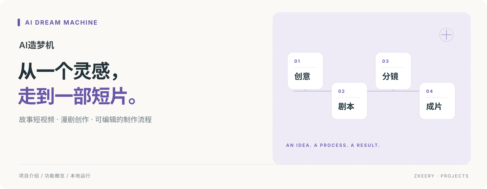
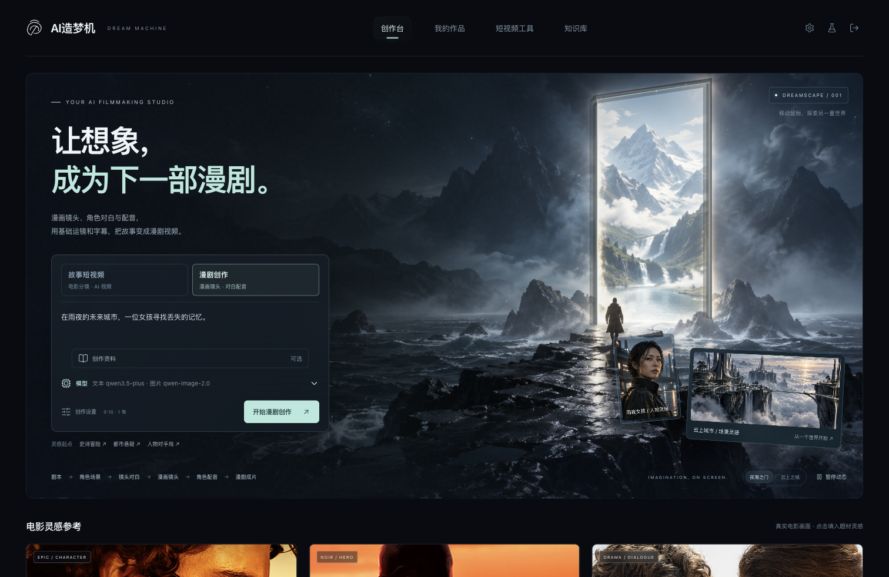

# AI造梦机

**把一个故事想法，逐步做成可以预览、修改和下载的视频。**

面向短视频与漫剧创作者的本地 AI 创作工作台。把剧本、角色、分镜、画面和成片放在同一个流程里，每一步都可以先检查，再继续。

[快速开始](#快速开始) · [使用说明](docs/使用与运维说明.md) · [更多文档](docs/README.md)

## 创作工作台



*创作首页界面。背景与灵感卡为展示素材，生成作品在「我的作品」中查看。*

## 可以做什么

- **故事短视频**：从创意开始，生成剧本、角色场景、分镜、参考图、视频片段并合成成片。
- **漫剧创作**：制作漫画镜头图，添加对白、配音、基础运镜与中文字幕。
- **快捷工具**：文艺短视频、角色动作短片与图片配音口播。
- **资料与作品管理**：绑定创作知识库，修改内容、切换版本、复用素材；符合恢复条件的中断任务可以继续。

## 怎样完成一部作品

1. 选择故事或漫剧，写下创意，设置比例、模型与参考资料。
2. 检查剧本、角色和分镜，按需编辑或局部重新生成。
3. 确认画面后生成视频，或为漫剧生成配音并合成。
4. 预览和下载成片；回到「我的作品」继续修改。

## 快速开始

准备 Python 3.12、Node.js 24、FFmpeg / ffprobe。以下命令适用于 macOS / Linux：

```bash
git clone https://github.com/Zkeery/ai-dream-machine.git
cd ai-dream-machine
cp .env.example .env
python3.12 -m venv backend/.venv
backend/.venv/bin/pip install -r backend/requirements.txt
npm --prefix frontend install
(cd backend && .venv/bin/python scripts/manage_invite_codes.py generate -n 1)
bash start.sh
```

在 `.env` 填入自己的 `AIHUBMIX_API_KEY` 后启动。打开[本地创作台](http://127.0.0.1:3030)，使用命令生成的邀请码登录。后端端口为 `8030`；按 `Ctrl+C` 停止服务。

真实生成会调用付费模型；界面浏览和离线测试不等于真实生成。知识库首次使用会下载检索模型；漫剧配音需要联网，Linux 需配置中文字体 `COMIC_FONT_PATH`。

## 当前范围

这是本地 MVP，采用 Next.js + FastAPI，数据保存在 SQLite、本地媒体目录与 Qdrant。后端按单 worker 运行。漫剧目前以单集、基础运镜为主；角色一致性与成片质量仍需人工检查，嘴型同步的真实样片效果待验收。模型费用展示为估算，具体以供应商账单为准。

## 文档与代码

[使用与恢复](docs/使用与运维说明.md) · [配置示例](.env.example) · [文档导航](docs/README.md)

前端在 `frontend/`，后端在 `backend/`；需求、技术方案与历史验证记录统一放在 `docs/`。
