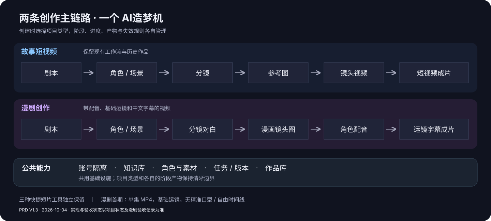
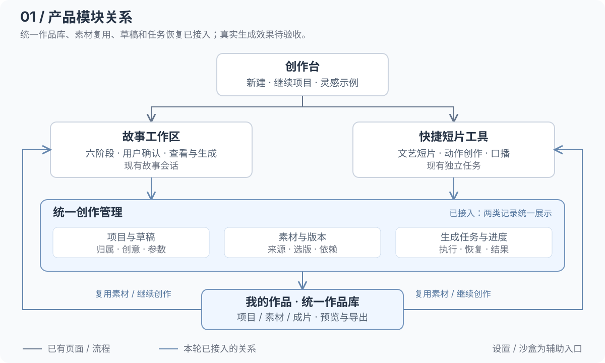
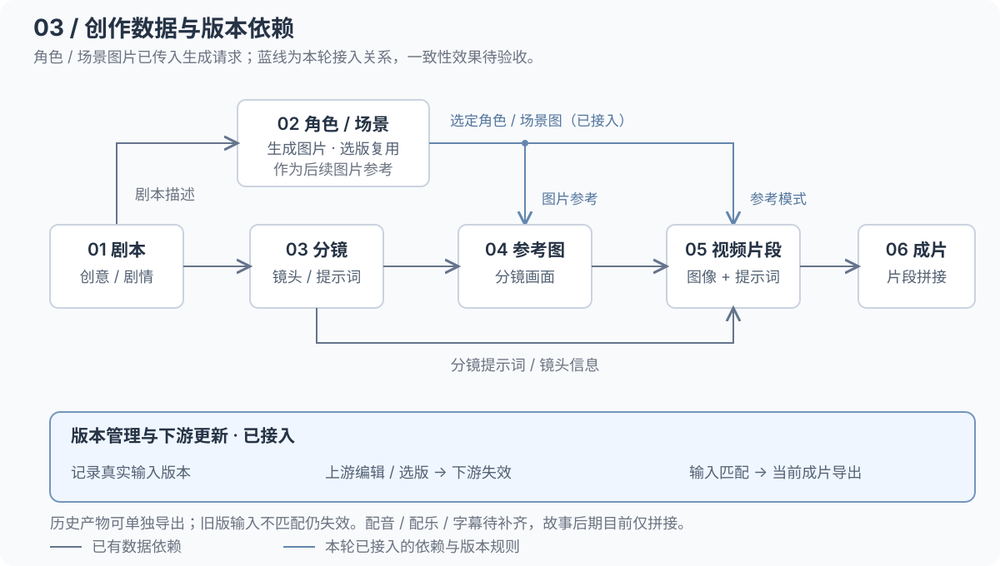
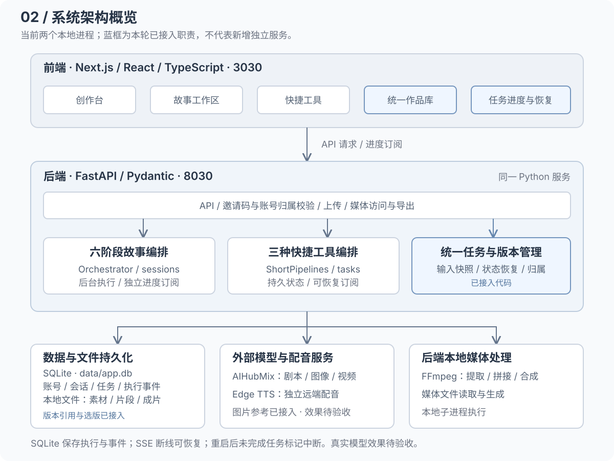
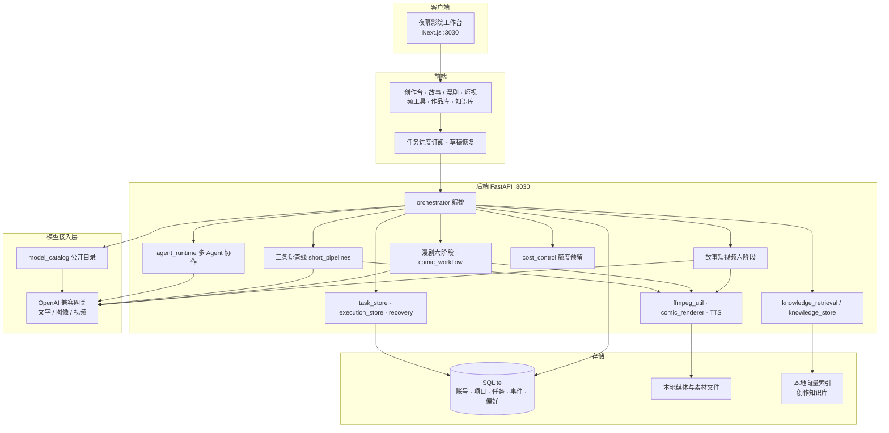
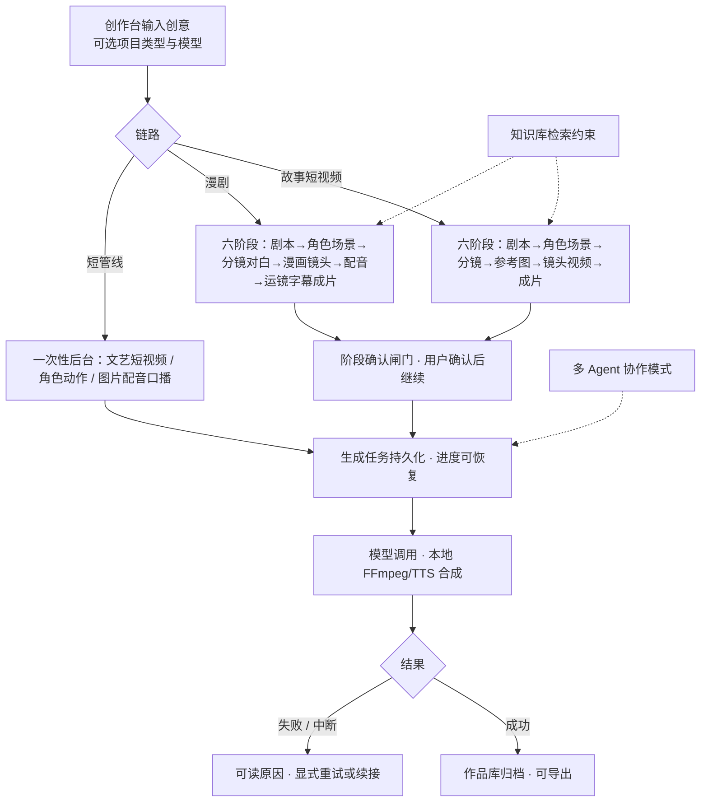
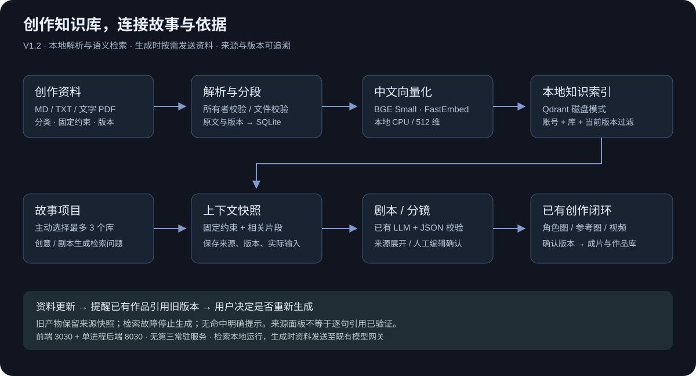
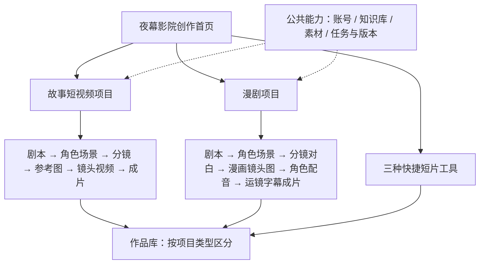

# AI造梦机 · PRD V1.3

**产品定位：AI造梦机是一款面向个人创作者和小型内容团队的 AI 视频创作平台，帮助用户将创意或故事，通过可编辑、可确认的制作流程，转化为故事短视频或漫剧视频。**

产品围绕两条独立创作链路组织功能：故事短视频制作镜头视频并合成成片；漫剧制作漫画镜头、角色配音与运镜字幕视频。用户可以在关键阶段修改和确认，保留素材、版本及进度，最终预览和导出作品。三种快捷短视频工具服务于已有明确文案或素材的单次创作需求，知识库与作品库为两条主链路共用。

### 文档信息

2026-10-05新增：故事、漫剧在首页新建时统一使用多 Agent 自主协作，不提供标准工作流切换；旧草稿再次创建同样启用。每阶段由规划 Agent 分配任务，研究及专业 Agent 独立决定受限工具行动，审稿 Agent 检查交付并对文本最多自动修改一次；媒体重生成和进入下一阶段仍需用户操作。已创建的历史作品保留原有模式，后端标准工作流用于兼容旧项目。用户端只展示创作内容、操作、费用与必要状态，不展示协作机制、Agent 分工记录、来源标注、模型供应商和调试说明；内部执行记录继续保留。执行限制、检查点和验收证据见[多Agent协作](../多Agent协作.md)及[项目状态](../项目状态.md)。三种快捷工具不随本次升级改变。

| 项 | 内容 |
| --- | --- |
| 产品版本 | V1.3。既有故事闭环见第 1–9 节，创作知识库见第 10 节，漫剧独立链路见第 12 节 |
| 当前范围 | 本地试用；故事短视频与漫剧视频两条独立链路、三种快捷短视频工具、共用知识库及作品库 |
| 最近修订 | 2026-10-05，用户确认实施图片配音口播嘴型同步（第2.4.1节），采用原生声画同步方案；同步修正角色动作短片不应强制上传未使用的动作视频。当前实现与本轮验收进展见项目状态，既有双样片结论保持 |
| 需求与验收 | 本文定义产品要求；需求决策见[补全清单](PRD补全清单.md)，实现和验收证据见[项目状态](../项目状态.md) |
| 当前验证边界 | 2026-10-05后端383/383、前端78/78及类型/Lint/构建通过；新增10秒嘴型口播样片完成且可见嘴部动作，台词与精细同步待听审。既有故事/漫剧样片的视觉一致性、语音自然度及RAG独立集问题仍保持，见项目状态与第9、10、12节 |

---

## 1. 用户问题、使用场景与产品目标

### 1.1 为什么做这个产品

用户的起点通常是一句创意、一段故事或已有文案，目标却是一部能观看、能修改、能导出的视频。完成这件事需要把内容拆成剧本、角色、镜头、画面、声音和最终成片。个人创作者或小型团队往往需要自行组织这些步骤、在工具之间搬运素材，并在修改时判断哪些结果还能继续使用。

AI造梦机要解决的是这段制作过程中的组织与操作负担：让用户先决定做故事短视频还是漫剧，再按清晰步骤完成制作；让生成结果可检查、可修改，失败后可继续，已有素材和作品可找到、可复用。产品不要求用户先具备专业剪辑和多工具编排能力。

上述问题是本期需求与流程走查形成的产品问题定义，尚不代表已完成大规模用户访谈，也不预设效率提升或留存指标已经得到验证。

### 1.2 为谁服务

| 目标用户 | 常见起点与动机 | 需要产品帮助完成的事 |
| --- | --- | --- |
| 个人故事类短视频创作者、自媒体创作者 | 有创意或短篇故事，希望做成一集剧情内容，缺少完整制作经验 | 拆出剧本和镜头，生成所需画面与片段，逐步确认后拿到可预览、可导出的视频 |
| 漫剧创作者 | 有剧情、角色设定或对白，希望用漫画画面和声音讲清故事 | 保持角色设定，编排镜头与对白，生成漫画镜头、角色配音及运镜字幕成片 |
| 小型内容团队 | 多次制作内容，需要沿用角色、世界观、资料及已确认素材 | 在同一创作空间管理项目资料、版本和结果，局部修改后继续制作；本期不包含多人协同编辑 |

管理员负责平台配置和诊断，属于辅助角色；模型选择、创作和作品管理应由普通创作者直接完成。

### 1.3 在什么场景下使用

| 场景 | 用户当时要做什么 | 产品应提供的过程 | 用户最终获得什么 |
| --- | --- | --- | --- |
| 从创意制作故事短视频 | 把一个情节或故事梗概变成一集视频，先确认内容方向再投入生成 | 创意 → 剧本 → 角色/场景 → 分镜 → 参考图 → 镜头视频 → 成片；默认1集，关键步骤可确认和修改 | 按镜头组织、可预览和导出的故事短视频，以及对应素材与版本 |
| 从剧情制作漫剧 | 把人物对白和剧情做成可观看的视频，而非停留在静态漫画图 | 创意 → 剧本 → 角色/场景 → 分镜对白 → 漫画镜头 → 角色配音 → 运镜字幕成片 | 一集带角色配音、基础运镜和中文字幕的漫剧MP4 |
| 已有文案或人物图，快速做一支短片 | 内容方向已清楚，只需要文艺图文视频、人物动作短片或图片配音口播 | 进入对应快捷工具，提交所需文案/素材，查看任务状态并获取结果 | 一次创作的短视频结果；不必经过主链路全部阶段 |
| 继续创作或局部返修 | 已有部分满意结果，只想改一句对白、一个镜头或一张图，或在中断后继续 | 找回项目和已选版本，修改目标内容，显示受影响的下游，再由用户发起必要更新 | 保留可用部分和历史结果的修订作品 |
| 沿用设定或资料创作 | 希望多个镜头/作品遵守已有角色设定、世界观或资料约束 | 绑定本人知识资料，在生成环节提供相关内容与固定约束，保留来源信息 | 有资料依据、可核对来源的剧本或分镜；生成一致性仍需检查 |

### 1.4 需要解决的问题与对应需求

| 用户问题 | 需求 | 判断是否解决的依据 |
| --- | --- | --- |
| 有想法，但不知道如何组织成可制作内容 | 从创意生成结构化剧本，继续拆出角色、场景和镜头；用户能在生图前修改确认 | 已确认内容实际成为后续输入，镜头顺序和对白可检查 |
| 制作步骤分散，素材关系和进度难以管理 | 每个项目明确类型、当前阶段、输入、产物和下一步；自动保存草稿与任务状态 | 切页、刷新或重新进入后能找到项目与进度，不重复提交生成 |
| AI结果不符合预期，难以控制修改 | 提供适用模型选择、阶段编辑、选版和局部重新生成 | 保存的选择进入请求，修改范围可解释，不改动无关素材或伪造历史来源 |
| 角色、剧情与资料容易前后不一致 | 已确认的角色图和场景图进入后续视觉生成，知识资料与约束进入相关文字生成 | 输入引用与来源可追溯；真实多镜头样片按一致性标准验收 |
| 失败或修改后需要从头再来，产生重复操作和费用 | 保留成功产物、失败输入和历史版本，提示过期依赖，重试由用户发起 | 能恢复或明确中断；只更新必要部分，刷新不触发收费生成 |
| 试建的项目和已有作品难以整理 | 统一作品库，按类型/状态查找、继续创作、预览、导出或确认删除 | 能找到自己的作品，误建项目可清理，其他账号不能访问 |

### 1.5 本期交付目标与边界

两条主链路应分别完成从输入创意到预览、下载和归档的闭环。故事短视频默认生成1集；漫剧首期为单集，输出视频。用户不需要进入管理员设置才能创作或选择已开放的模型。

本期优先验证可完成创作、可控修改和可恢复进度。故事与漫剧需分别用真实模型小样检查叙事、画面、人物一致性及最终播放效果；工程测试片不能代替这项验收。量化效率收益需后续采集真实使用数据，当前不写为已达成结论。

本期不包含专业多轨剪辑、漫剧精准口型、完整动作迁移、多人协同、自动发布或会员计费。图片配音口播的嘴型同步按第2.4.1节单独实施；配乐编辑、续写、多集批量管理等增强能力按第5、12节的范围另行安排。

---

## 2. 输入、过程和产物

### 2.1 输入
- **故事短视频项目**：一句创意或一段梗概；可选视觉风格、适用画幅参数和模型，剧集数默认1集
- **漫剧项目**：创意、剧情或角色对白；可选风格、图片/文字模型及画幅，首期固定单集；分镜阶段可编辑对白和声线
- **共用创作资料**：可绑定本人知识库，提供角色设定、世界观和固定约束；使用范围与来源显示规则见第10节
- **快捷短视频工具**：
  - 文艺短视频：创作灵感或完整文案
  - 角色动作短片：角色参考图 + 动作描述；本期不承诺按视频迁移动作
  - 图片配音口播：人物图片 + 口播文案；可选人物嘴型同步或静态图片配音，具体能力与限制见第2.4.1节

### 2.2 故事短视频的阶段输入与确认

下表定义故事短视频六阶段。漫剧使用独立的分镜对白、漫画镜头、角色配音与合成阶段，完整合同见第12.2节；两类项目创建后不原地切换类型。
每个阶段产物都可查看，并按本阶段能力编辑或选版后重新生成。生成输入必须引用用户已确认的上游版本；角色 / 场景设计产生的图片要实际进入后续视觉生成。

| # | 阶段 | 使用的输入 | 产物与确认 |
| --- | --- | --- | --- |
| 1 | 剧本策划 | 创意、风格、剧集参数；重新生成时包括用户编辑内容 | 标题、梗概、角色列表、场景列表、剧集正文；确认剧本后进入下一阶段 |
| 2 | 角色/场景设计 | 已确认剧本、角色 / 场景描述、视觉风格 | 角色图、场景图及版本；可修改提示词、选定版本 |
| 3 | 分镜规划 | 已确认剧本、选定角色 / 场景的身份与版本 | 分镜表，包含镜头顺序、角色 / 场景关联、画面描述与提示词；可编辑并确认 |
| 4 | 参考图生成 | 已确认分镜、镜头关联的角色图与场景图 | 每个分镜的参考图；可选版后确认 |
| 5 | 视频生成 | 已确认参考图、分镜提示词及所选模式需要的素材 | 视频片段；可单独重新生成镜头并选版 |
| 6 | 成片合成 | 选定且有效的视频片段、镜头顺序 | 按顺序拼接成片，可预览和下载；故事配音、配乐、字幕编辑属于后续增强，漫剧配音与字幕走独立阶段 |

如果当前模型不支持所需的图片参考能力，应明确显示能力限制和待接入状态。仅传文字描述不能验收为「角色参考图已接通」。

### 2.3 产物（长期保留，可导出）
- 剧本数据、角色/场景图、分镜、参考图或漫画镜头、对白配音、视频片段、最终成片
- 全部**本地留存，并支持导出**
- 故事项目、漫剧项目与快捷创作的结果都进入「我的作品」，可按类型、状态和最近更新时间查找
- 每个素材记录来源项目、生成阶段 / 工具及版本；从结果可以返回对应创作上下文
- 本人生成的角色图、场景图等可主动选作后续创作的输入，避免反复下载再上传；上传素材仍遵守第 7 节的用途边界

### 2.4 三条一次性短管线（无分阶段人工停点，后台跑 + 进度订阅）

| 工具 | 输入 | 本期产物 | 能力边界 |
| --- | --- | --- | --- |
| 文艺短视频 | 灵感或完整文案、适用的风格参数 | 图片与配音合成的视频 | 文本模型用于短文扩写，图片模型生成画面；本期不调用镜头视频模型 |
| 角色动作短片 | 角色参考图 + 动作描述 | 按角色参考与描述生成的视频片段 | 不包含参考视频的真实动作迁移 |
| 图片配音口播 | 人物图 + 口播文案 + 产物模式 | 人物嘴型同步视频，或静态人物图与配音合成的视频 | 嘴型模式生成10秒720p素材后裁去持续静音尾段，模型原生生成语音；静态模式无嘴型同步，见第2.4.1节 |

工具页在用户提交前说明实际产物形态。角色动作短片只要求人物图和动作描述，不再要求上传当前未使用的动作视频；历史视频输入保留且仍校验归属。完整动作迁移另行评估，嘴型同步按下节的新授权范围实施，不能回写为历史闭环已通过。

#### 2.4.1 图片配音口播增强：人物嘴型同步（2026-10-05）

**需求状态：用户已确认继续实施，纳入本轮开发范围。** 最初仅要求记录可选需求，后续明确要求做完；以最新授权为准。工程接入与真实效果分开验收，未通过的检查不得记为完成。

**用户问题与目标**：用户提供人物图和文案，希望看到画面中的人物张嘴说出这段话。目标产物是嘴部动作与语音对应的口播视频，能看出人物正在说话；静态图加声音的成片不能满足该目标。

**输入与输出**：输入一张人物图和口播文案，推荐正面或半身、嘴部清楚的单人物图。嘴型模式采用AIHubMix `wan2.6-i2v`原生声画同步，由同一模型生成语音与嘴型；生成10秒、720p素材，再裁去持续静音尾段，成片可能短于10秒，文案最多40个非空白字符。裁尾保留350ms余量，不删除中间停顿，原片保留；全静音音轨报错。静音检查不证明台词完整或精细同步，裁尾不改变原生成费用。音色由模型生成，暂不支持指定Edge TTS声线、上传配音或声音克隆。输出可预览、可下载的有声MP4；静态模式继续使用Edge TTS与本地合成。人物素材沿用第7.4节边界，不新增多人轮流讲话、全身动作或直播能力。

本轮选择原生声画同步，是因为现有网关已提供该协议；固定音频驱动要求供应商可访问的公网音频URL，当前本地TTS没有此交付路径。本轮不增加公网素材托管，不用后配TTS覆盖模型音轨。40字符是应用的保守输入限制，不保证模型必然逐字读完；完整性仍须按LIP02、LIP03检查。

**预期流程与行为**：

1. 用户进入图片配音口播，选择模式、人物图并填写文案。新草稿默认嘴型同步，已有草稿或历史任务缺模式字段时按静态兼容。提交前明确显示产物模式、模型、10秒/40字符限制、音色来源与估算费用；超限保留草稿并提示缩短。
2. 嘴型模式把人物图和逐字台词交给模型，要求普通话、自然语速、单一连续镜头、无旁白和配乐；嘴部运动应与原生语音对应，保持人物外观与背景基本稳定。
3. 用户可查看嘴型生成及成片校验状态，预览带声音的视频，并从作品库重新查看和下载。成功结果记录实际模式与模型；历史静态作品明确标为静态。沿用既有任务持久化、供应商任务续接、账号隔离和费用控制。
4. 图片不适用、模型不支持、供应商失败或结果缺少音轨时，明确说明原因并保留输入及已落盘产物。不得自动用静态视频或另配TTS冒充嘴型同步成功；已受理任务优先查询或下载续接，不重复收费提交。

**验收标准**：

| 编号 | 验收场景 | 通过条件 |
| --- | --- | --- |
| LIP01 | 单人物图片 + 中文口播文案生成真实样片 | 人物在说话段落有连续嘴部动作；静音观看仍能判断其正在说话，不能整段保持静态图片 |
| LIP02 | 覆盖连续讲话和句间停顿的真实样片 | 正常播放时口型与发音节奏基本一致，停顿时不持续做说话动作，无持续明显的音画错位；听看核对台词、同步效果与自然度，记录通过项和具体瑕疵，不把存在音轨当作效果验收 |
| LIP03 | 检查完整视频并下载播放 | 配音内容完整、结尾不截断，视频可播放；人物身份特征与背景基本稳定，无明显嘴部撕裂、牙齿异常或面部变形 |
| LIP04 | 不支持的输入或嘴型生成失败 | 有明确失败说明和可恢复输入；不会把静态合成结果标为嘴型同步成功，后续重试遵守既有显式操作与费用规则 |

**模型与成本**：采用`wan2.6-i2v`标准版，官方默认生成音频，单镜头参数为`extra: {prompt_extend: true, shot_type: "single"}`。720p官方单价为$0.0904/秒，按项目固定预算系数8估算10秒约¥7.232，不等于供应商最终账单。一次生成仅提交一次，未知结果不自动重提。[网关协议](https://aihubmix.com/call/schema/models/wan2.6-i2v/endpoints)、[模型价格](https://aihubmix.com/model/wan2.6-i2v)、[厂商接口说明](https://help.aliyun.com/zh/model-studio/image-to-video-api-reference)于2026-10-05核对。具体效果以真实样片为准。

### 2.5 产品对象与术语
| 词 | 含义 |
| --- | --- |
| 项目 | 一次分阶段创作的组织单位，包含创意、参数、素材、执行记录与结果；类型为故事短视频或漫剧视频 |
| 会话 | 项目的内部持久记录；兼容历史故事记录，漫剧通过项目类型区分 |
| 阶段 | 所属项目类型的6个制作步骤之一；故事和漫剧各自独立 |
| 素材 / 产物 | 上传或生成的剧本、角色图、场景图、分镜、参考图、音频、视频片段与成片，关联所属项目和来源 |
| 生成任务 | 一次后台生成执行，关联项目、阶段或快捷工具，保存输入版本、模型、状态、结果和错误；故事、漫剧与快捷创作均显示真实执行状态 |
| 作品库 | 「我的作品」页面，统一查找项目、素材与成片，不另存一套重复结果 |
| 版本 | 同一内容的编辑或生成结果；历史版本保留，选定版本供后续步骤使用 |

首页未提交的草稿关联当前账号。用户点击开始故事/漫剧创作时建立对应项目，之后逐阶段生成，不要求用户先命名项目。快捷工具提交后建立任务。现有会话、短任务和产物需兼容映射到上述产品视图，保留历史标识、归属和文件。

### 2.6 页面与模块职责

| 页面 / 模块 | 用户任务 | 与其他模块的关系 |
| --- | --- | --- |
| 创作台 | 选择故事短视频或漫剧、填写创意与模型、继续最近项目、使用灵感示例 | 进入所选类型的创作空间；首页不承担完整阶段编辑 |
| 故事工作区 | 查看、编辑、确认六阶段产物，选择素材与版本，生成成片 | 所有步骤留在同一故事项目，结果进入作品库 |
| 漫剧工作区 | 编辑剧本、角色、镜头对白和声线，生成漫画镜头、配音与成片 | 沿漫剧独立阶段制作，结果进入共用作品库 |
| 快捷短片工具 | 直接完成文艺短视频、动作创作或口播 | 保留独立的单次生成流程；结果统一归档，可从作品库继续 |
| 我的作品 | 查找全部项目与成片，查看状态、预览、导出、继续创作或删除误建项目 | 统一展示故事、漫剧及三种快捷任务；可复用素材通过对应素材选择入口使用 |
| 知识库 | 管理创作资料，选择本项目需要遵循的设定与约束 | 故事与漫剧共用资料能力，各项目独立绑定；不自动扩大到快捷工具 |
| 生成任务入口 | 查看进行中、失败和已完成的生成，定位错误、重试或打开结果 | 从工作区和作品库均可进入，使用同一份任务状态 |
| 设置 / 沙盒 | 管理员查看平台配置、健康状态与诊断信息 | 仅管理员可访问；普通用户在创作表单和阶段中直接选择模型 |

用户路径：创作台选择故事或漫剧 → 进入对应工作区 → 分阶段制作 → 我的作品中预览、导出或继续。已有明确素材的用户可直接进入短视频工具完成单次任务。知识库、作品库与任务恢复服务于对应创作流程，不要求用户反复离开工作区搬运结果。

### 2.7 草稿、参数与导航

- 创意、口播文案、提示词、风格、比例、剧集数和当前工具等适用字段自动保存；切换模块、刷新和返回后恢复。不同工具保留各自草稿，按账号隔离。
- 首页切到快捷工具时完整传递文本与该工具支持的参数；不支持的参数明确说明，不能静默改成默认值。
- 未上传的本地文件不能承诺刷新后恢复。离开页面前说明重新选择的影响；已上传文件保存引用，返回后显示真实上传状态。
- 提交失败保留输入和选定素材，显示原因；只有确认提交成功后才可清理提交区，且输入仍在项目 / 任务详情可查。
- 故事项目、工具类型和作品详情具有可恢复的页面地址；刷新、前进、后退保持对应页面与项目，不返回错误上下文。
- 新建另一创作保留原有草稿；清空草稿是独立明确操作。

### 2.8 产品模块关系图

当前双主链路及共用能力关系：

下面保留既有故事流程与快捷工具的模块关系图；漫剧新增关系以当前双链路图及第12节为准。

创作台、故事工作区和三个快捷工具已有入口；蓝色框与连线表示已接入代码的统一关系。「我的作品」已统一展示项目与快捷任务，已接通素材复用、草稿保留和任务进度恢复；底层兼容现有故事会话与快捷任务记录。图上的生成任务是执行与进度职责，用户在原工作区查看进度，也可从统一作品库打开对应作品继续。2026-10-04新增故事/漫剧真实样片完成工程闭环，画面一致性及声音自然度按第9节继续评价，不以代码接入替代内容质量结论。

[打开模块关系原图](diagrams/product-modules.svg)

---

## 3. Agent 主链路

### 3.1 分阶段创作与人工确认

故事与漫剧各自包含6个制作阶段。以下确认、修改与恢复规则共用，具体阶段和产物按项目类型区分。
- **分步确认**：每个阶段完成后停下，用户确认 / 修改后才进入下一阶段，不自动跳过
- **可修改**：角色、场景、分镜、参考图、视频都可修改后重新生成，不每次从头来
- **可续写（后续增强，不计本轮整改与验收）**：剧本可智能续写新剧集（追加剧情、新角色、新场景，用户确认后合并）

**人机边界（哪些必须人动手）**：

| 动作 | 是否必须人确认 |
| --- | --- |
| 剧本定稿 | ✅ 硬闸门：确认后才进入下一阶段 |
| 角色/场景图选版、分镜/参考图修改 | 可选编辑；继续时使用已选定版本 |
| 视频重生成及因上游修改而更新下游 | 用户主动发起，执行前说明影响范围；不自动重跑收费生成 |
| 续写内容合并 / 取消（后续增强） | ✅ 必须人确认（合并或丢弃二选一，不计本轮整改与验收） |
| 删除项目 / 删除产物 | ✅ 必须人确认 |

### 3.2 故事短视频的三种视频生成方式（第5阶段可切换）
- **首帧生视频**：以选定分镜首帧图和分镜提示词生成片段
- **首尾帧生视频**：使用当前片段的起点图与终点图；实际调用必须传递两者
- **参考图生视频**：读取所选角色图、场景图等参考素材，约束角色 / 场景一致性

三种模式保留为原有产品目标。界面只开放当前模型已经接通并验证的模式与参数；尚未接通的能力标为待接入。不能让不同模式实际发送相同的单图输入，却声称完成首尾帧或多素材参考。

### 3.3 短管线（一次性后台执行）
一次输入 → 后台执行 → 订阅进度 → 出片并归档，中间无需六阶段人工停点。任务失败给出可读原因并可重试；重试由用户发起。

### 3.4 素材依赖、编辑与重新生成

1. 每个生成任务保存本次使用的剧本、分镜、角色 / 场景和参考图版本。生成过程中修改上游不会悄悄改变已经提交的任务输入。
2. 用户编辑剧本或分镜后，修改内容必须进入后续生成输入，不能重新读取最初创意覆盖编辑。
3. 上游修改或选版影响下游时，列出受影响的参考图、视频或成片，标记「待更新」并保留历史结果。
4. 用户选择需要更新的范围，再启动相应任务；没有依赖变化的镜头可继续复用。
5. 最新成片只能组合当前选定且有效的片段；不能静默混用旧下游结果。用户仍可明确选择预览或导出历史成片。
6. 重新生成产生可追溯的新版本，不删除已有产物，不把失败结果替换成已成功版本。

这张图展示当前代码的数据依赖：灰色实线为原有传递，蓝色实线为已接入关系。选定角色和场景图片已传入参考图请求，也传入参考模式的视频请求；每次执行记录输入版本与素材来源，上游编辑或选版会标记受影响下游失效。历史版本保留；旧版本绑定的上游与当前选用版本不匹配时仍失效，不能作为当前成片导出，明确的历史成片可单独导出。**本轮已运行真实两镜头样片，仍观察到尺度、人物合成感、画风与信封颜色偏差，不能宣布稳定一致性通过。** 故事后期目前只拼接片段，完整配音 / 配乐 / 字幕仍是原有成片目标，不能因图中有「成片」节点就认定全部实现。

[打开创作数据原图](diagrams/creation-data-flow.svg)

### 3.5 生成任务与恢复

| 任务状态 | 用户看到的结果与可执行动作 |
| --- | --- |
| 排队中 | 已接收输入，显示等待状态，可打开所属项目 |
| 生成中 | 显示当前阶段与实际进度；切页和刷新后恢复跟踪 |
| 已完成 | 结果已经保存，可预览、导出和返回项目；同步出现在作品库 |
| 失败 | 显示可读原因，输入与已有成功产物保留，可主动重试 |
| 已中断 | 服务重启等情况下无法确认原执行结果，说明原因并提供查询 / 重试路径，不能永久显示生成中 |

- 任务执行独立于页面与进度连接。用户关闭、切换或刷新页面，不取消后台生成；重新连接不创建新任务。
- 进度、完成结果和错误持久化。断流后可读取状态快照并重新订阅，不能只依赖某一次连接的内存事件。
- 服务重启时核对未结束任务：能查询模型侧任务的继续查询；无法恢复的标为中断。不得自动重新提交可能重复计费的生成。
- 同一任务的重复点击 / 重复提交要被阻止，避免创建重复执行；多个页面查看同一任务不能互相消耗进度事件。
- 每次执行有唯一结果归档；状态以保存的任务事实为准，不能因页面重新挂载就变成可再次生成。
- 故事阶段的完成与用户确认分开记录：阶段生成完毕后等待确认，不自动推进，也不因刷新重复执行。

**继续未完成与重新生成必须分开：** 用户希望继续之前已提交的任务时，系统应优先查询或下载原供应商任务，而不是再次购买同一轮生成。继续操作固定原执行的模型、参数、上游选用、素材文件和适用的知识版本；任何影响输入的变化都要拒绝原执行续接并给出原因。用户希望使用变化后的输入时，才发起新的生成。

只有失败/中断且具有可核对恢复记录的任务显示「继续未完成阶段/任务」。已受理的图像/视频任务查询或下载；原执行尚未提交、明确HTTP未受理或本地门禁拒绝的`rejected`步骤，可以在用户明确继续后创建新attempt，仍受并发和费用约束，界面说明可能正常计费并保留其他成功产物。旧任务没有冻结快照、已受理后最终失败，或`unknown`及408/409/5xx等提交结果不明时，不得伪造恢复成功或自动重提。未知结果必须提示核对模型侧任务与费用。

### 3.6 系统架构概览

下图保留既有故事与快捷工具的基础架构。V1.3新增的双链路、知识库与权限/模型职责以下表为准；双链路关系见第2.8、12节，知识库架构见第10节。

下列 Mermaid 图按当前代码核对补充（端口 **3030 / 8030**），与上图并存，不替代历史 SVG。

当前本地运行Next.js前端与FastAPI后端。故事、漫剧、快捷工具及知识库由同一后端服务提供；知识检索采用本地嵌入模型和向量库。执行与进度事件持久化到SQLite，SSE断线后可重新订阅；重启后的未完成执行标记为中断，保留输入与已有产物，按恢复条件由用户显式继续或重新生成。供应商任务与费用记录均在后端维护，前端只展示安全摘要。具体端口、接口与部署方式见技术文档；当前保持单worker，本轮新增恢复/限额的最终集成与真实样片结果见项目状态。

| 架构部分 | 当前事实 | 本轮接入状态与剩余边界 |
| --- | --- | --- |
| 前端 | 两类项目工作区、三种短视频工具、知识库与统一作品库；管理入口按角色控制 | 普通用户可选模型；草稿、参数、任务与页面上下文可恢复 |
| 后端业务 | 故事和漫剧独立编排，快捷任务独立执行；资源归属与管理员权限在后端校验 | 项目逻辑删除、素材版本依赖、模型输入快照与运行锁已接入 |
| 数据 | SQLite保存账号、项目、任务、执行、事件、偏好和模型来源；媒体存本地文件 | 知识库有独立元数据、原文版本与本地向量索引；保留历史记录 |
| 模型 | AIHubMix提供文字、图像和视频生成；Edge TTS在线配音 | 公开兼容目录限制选择；每次请求使用所选模型，实际来源与偏好分开保存；真实效果待验 |
| 媒体处理 | 故事按镜头拼接；漫剧使用本地FFmpeg/Pillow合成漫画镜头、配音、运镜与中文字幕 | 支持有效成片与历史成片下载；故事完整后期、精准口型等增强仍不在当前完成范围 |
| 创作知识库 | 故事与漫剧独立绑定本人资料，文字阶段检索相关片段与固定约束 | 来源可追溯；工程通过，独立检索留出集80%，未过项保留 |
| 执行与进度 | 后端单进程执行，状态、事件、原输入快照和供应商任务写入SQLite | 页面连接与执行解耦；中断后按原输入显式续接，未知提交不得盲重提 |
| 生成额度 | 后端校验全局/账号执行并发和月预算，收费调用前原子预留 | 工作区显示估算、预留与可用额度；供应商费用未知与0分开，当前不是账单或支付系统 |

原[阶段 1 架构方案](../阶段文档/架构方案.md)与[技术适配声明](../阶段文档/技术适配声明.md)保留为历史设计资料，其中 JSON 元数据、厂商 SDK 直连和后续才加入账号等描述已经被后续实现更新。当前架构事实以上述概览、项目代码和状态记录为准；各整改批次实施时同步对应技术文档。

### 3.6.1 主业务流程（代码核对）

人工确认、素材依赖与任务续接规则见上文 §3.1–§3.5；双主链路细节见 §12。

[打开系统架构原图](diagrams/system-architecture.svg)

---

## 4. 什么算「生成得好」

### 4.1 成功标准
1. 从一句创意能走完到完整成片，中途不卡死
2. 角色 / 场景在多个镜头间保持一致
3. 风格、画面稳定，无明显崩坏
4. 用户可确认、可修改、可继续生成，不每次从头来

### 4.2 瑕疵容忍
- 个别镜头瑕疵、字幕标点错误可接受
- 由创作者本人判断好坏

### 4.3 已确认的效果标准与本轮验收

- D7 已于 2026-09-23 确认：每条样例按「符合描述、质量可用、风格一致、无违规内容」四个维度打 1～3 分，**平均 ≥ 2 分且没有 1 分项**即合格。
- 原阶段 2 的五条真实样例已通过产品经理打分，记录见[样例打分表](../evidence/阶段2/样例打分/打分表.md)。历史结果保留，不等于本轮新要求已经验收。
- 本轮闭环整改按第 9 节验收。草稿、导航、任务恢复等先做不调用真实模型的验证；素材参考接入后再按原效果标准验收真实镜头一致性。

---

## 5. 交付阶段与优先级

按已确认范围补齐创作闭环。下列三个批次的**核心关系已接入代码并通过对应离线回归**，包括角色 / 场景提示词与描述编辑、指定单项或多镜头重生成，以及按实际引用保留未受影响素材；原通过条件保持不变。AC07图片引用合同已验证，本轮真实两镜头样片完成工程闭环，但尺度、人物与颜色一致性仍需迭代。

| 顺序 | 批次 | 交付范围 | 完成条件 |
| --- | --- | --- | --- |
| 1 | 创作与生成稳定性 | 草稿与当前表单恢复、失败保留输入、适用参数传递、后台任务与重连 / 重启恢复 | 第 9 节 AC01～AC06 通过 |
| 2 | 故事素材与版本闭环 | 角色 / 场景引用进入后续生成、编辑内容有效、上游修改后的失效提示、有效版本成片 | AC07～AC09 通过，真实效果另验 |
| 3 | 统一作品归档与复用 | 四种创作统一作品库、素材选择与来源关联、继续创作与完整页面导航、历史兼容与账号隔离 | AC10～AC13 通过 |

已接入的代码范围、离线验证入口和剩余边界见[本轮技术适配与开发说明](../阶段文档/V1.1-创作闭环-技术适配与开发说明.md)及第 9 节；本表继续保留原需求与完成条件，不把测试替身产物记作真实生成效果。

以下保留原阶段划分，作为历史范围与后续增强边界；已实现情况以项目状态为准。

### 5.1 第一刀（最小可用，必做）
6 阶段主流程：一句创意 → 完整成片，全链路跑通 + 产物留存 + 可导出（本地单机）

### 5.2 第二刀
3 条一次性短管线（文艺短视频、动作迁移、数字人口播）

### 5.3 第三刀（对外）
邀请码登录、账号隔离（用户只能看自己的数据）、多人使用

### 5.4 后续增强
剧本智能续写、独立的跨镜头一致性 Agent、并发分镜，以及完整动作迁移与漫剧精准口型。图片配音口播嘴型同步已按2026-10-05用户后续授权转入本轮实施，见第2.4.1节。本轮已接通已有角色素材的实际引用，不以引入额外 Agent 为前提。

### 5.5 非目标（本版明确不做）
- 不做专业级剪辑工具（多轨时间线、精细调色），成片由系统自动生成
- 不做实时 / 直播类能力
- 不做会员付费、广告变现体系
- 本轮保留已有邀请码登录与账号隔离，不扩大到会员、团队协作权限或在线发布体系

---

## 6. 模型与成本约束

### 6.1 模型厂商（国内为主）

- 当前沿用项目已接入的 **AIHubMix 网关**，通义模型用于剧本、图像与视频；具体模型标识与能力以本项目配置和技术文档为准。
- 保留原可插拔方向：通义直连、火山方舟及其他模型厂商按实际能力和成本评估，不在本轮文档更新中更换供应商。
- 新的参考图、首尾帧、动作迁移或嘴型同步能力，需验证真实输入支持和生成效果后才能开放。

### 6.2 成本上限
- 默认平台模型预算：**500元/月**；默认账号模型预算：**100元/月**，均由管理员配置。账期按北京时间自然月计算，平台预算按所有账号合计，不能按账号拆开后绕过平台总额。
- 付费模型请求提交前预留预计费用；任务完成后按可取得用量与当次价格表计算。新请求须同时满足账号与平台限额，不满足时明确拒绝，不先调用模型再提示超额。
- 页面区分「按表估算」「已预留」「可用额度」与「供应商已报告费用」。没有供应商费用数据时显示待核实，不显示实付0元。预算控制金额不能被宣传为供应商实际账单或已充值余额。
- 价格缺失、无效或不能对应实际模型/模式时阻止该收费调用，并给出可处理原因；不能按免费计算。未知提交保留预留，只有明确结果才能相应更新。
- 浏览、恢复订阅、查看历史、编辑保存和阶段确认不触发新的模型生成；额度摘要读取失败不得阻断这些操作。重新生成和续接未提交部分由用户明确发起，仍可能产生费用。

### 6.3 并发与资源限制

- 默认全平台最多同时2个执行，单账号最多1个执行。pending和running均占用名额；后台提交、普通生成和显式恢复统一检查。
- 同时到达的请求不得突破名额或预算，重复请求不得重复占款。超限时保留输入，提示等待或联系管理员，不进入永远排队状态。
- 本期在本地单worker、SQLite与本地向量库范围内实现，不据此承诺多进程、多机容量或生产SLA。并发和费用限制是生成入口约束，不改变普通用户访问本人作品、知识和模型目录的权限。

---

## 7. 数据与非功能要求

### 7.1 数据
- 产物（剧本、图片、视频）本地留存，可导出
- 项目、草稿、生成任务、素材引用、版本选择和人工确认点持久化，按账号隔离；退出账号后不向其他账号展示其草稿和素材。
- 不公开用户隐私或向无关第三方发送素材，不将用户上传素材用于本产品训练；支持删除。
- **上传素材的隐私处理**：上传内容只用于用户明确发起的本次生成，本地留存。生成确需传给模型厂商时，在提交前明确告知去向与用途；统一作品库不扩大原有上传用途。
- 生成素材可由本人主动选择复用；上传素材用于另一创作时需再次主动选择并明确用途，不自动跨项目复用。既有内容安全红线继续适用。
- 现有会话、任务与文件保留；新增归属关系或作品视图不得造成历史数据丢失、归属改变或已有访问 / 导出失效。

### 7.2 非功能
- 视频生成慢（单片段约 1～2 分钟），**必须异步 + 进度提示**，不能阻塞界面
- 文生图约 10～20 秒 / 张可接受；视频 1～2 分钟 / 片段可接受
- 文件限制：图片 jpg/png/webp ≤25MB；视频 mp4 ≤100MB
- 视频参数默认：16:9、720P、单片段 5 秒，前端可改
- 上述时长是体验参考，不作为模型厂商固定响应承诺。等待超过参考时长时仍提供真实状态与可处理结果。
- 参数只在实际支持时允许修改；保存值、生成请求与最终产物一致，不能仅在界面改变。
- 生成失败、网络中断和素材失效均有明确反馈，不丢草稿、不出现永久等待。

### 7.3 视觉与交互

- 延续用户已确认的 **「夜幕影院 3D」**：深色电影氛围、大幅视觉、克制排版和立体空间感；首页保持沉浸感，工作区保证内容与操作清晰。
- 3D、视差与动效集中用于首页视觉和适量反馈；编辑、素材选择、阶段确认和进度信息优先保证可读性与操作效率。
- 390、768、1280、1440 四档宽度均可完成核心操作，表单、任务与作品列表无横向溢出。
- 支持暂停动态、减少动态偏好与无 WebGL 的静态降级；键盘导航、焦点、文字对比度和媒体异常态保持可用。
- 空状态、生成中、失败、待更新和完成状态统一表达；工具能力边界在提交前可见。

### 7.4 内容安全红线
- **禁止生成**：真实公众人物/真人肖像、侵权 IP、违法内容
- 拦截方式：提示词侧 + 生成结果侧双向拦截
- 对外上线前须再次确认合规

---

## 8. 上线与账号

### 8.1 当前（第一版）
- 本地部署跑通，产物本地留存 + 导出
- 当前使用前端 3030、后端 8030；已有邀请码登录与账号隔离。暂不上云，继续本地自用。

### 8.2 对外（第三刀）
- 登录方式：**邀请码**
- 账号隔离：用户只能看自己的剧本 / 产物
- 云费用预算：待定
- 读取、上传、下载与跨项目素材引用均由后端校验当前账号的归属，统一作品库沿用该边界。

---

## 9. 本轮链路验收与当前差距

### 9.1 可执行验收用例

以下保留原验收场景与通过条件。对应能力已接入代码，并通过相关离线回归与页面检查；**AC07的调用引用与版本合同通过，真实两镜头样片工程闭环通过，内容质量需迭代**。2026-10-04最新批次后端357/357、前端69/69及类型/Lint/构建通过，两条样片均播放到结束无错误；视觉偏差、声音自然度及小样本边界见[真实样片验收](../evidence/真实样片验收/验收记录.md)和[样片预览](../evidence/真实样片验收/样片预览.html)，不能据此宣布D7全优或多人生产稳定。

| 编号 | 操作场景 | 通过条件 |
| --- | --- | --- |
| AC01 | 填写创意、风格与比例，切到设置 / 作品库后返回，再刷新 | 文本、适用参数、当前工具与项目恢复；不同账号互不可见 |
| AC02 | 首页填写参数后进入文艺短视频等快捷工具 | 文本与支持的参数完整传递；不支持项有说明，风格不静默重置 |
| AC03 | 模拟创建失败或网络失败后再次打开提交区 | 文案、参数和已上传素材仍在，显示可读原因；未上传文件明确提示重新选择 |
| AC04 | 开始生成，切页、刷新、断开后重连，并同时在另一页面查看 | 后台执行不依赖页面；恢复实际进度与最终结果，不新建任务，不相互丢事件 |
| AC05 | 任务失败后由用户发起重试 | 保留原输入与成功产物；新执行可追溯，结果不混入旧任务，无自动重复生成 |
| AC06 | 在有未完成任务时重启服务 | 可恢复的继续查询；不可恢复的进入明确中断状态，不长期显示生成中，不自动重复提交模型 |
| AC07 | 选定角色 / 场景版本，再生成相关镜头 | 实际调用包含正确的素材引用，生成输入版本可查；多镜头效果按第 4 节另行真实验收 |
| AC08 | 编辑剧本 / 分镜，或更换角色图后继续生成 | 用户编辑确实进入输入；明确列出受影响下游，标为待更新，历史结果保留 |
| AC09 | 部分镜头更新后导出最新成片，再打开历史版本 | 最新成片只使用所选有效片段；历史版本可独立预览 / 导出，不静默混用 |
| AC10 | 分别完成故事、文艺短视频、动作工具与口播 | 同一作品库能查到四类项目和结果，显示来源与状态，可进入对应创作；每个结果不重复归档 |
| AC11 | 从作品库选择已有生成角色图作为工具输入，并测试另一个账号 | 不需下载再上传，来源关联保留；他人素材不可读、不可引用，上传用途限制仍有效 |
| AC12 | 直接打开项目、工具或作品地址，再刷新、前进与后退 | 返回同一上下文；不存在或无权访问的内容有明确提示，不跳入旧故事 |
| AC13 | 用已有会话、短任务及历史产物进入新作品库 | 归属、标识、文件和原有导出保留，无丢失；历史数据不被当作新生成结果 |

AC01～AC06、AC08～AC13 可在隔离环境中使用模型替身和页面操作验证；持久化恢复用例需实际重启隔离服务并读取原有记录。AC07 的调用依赖可先隔离验证，真实视觉效果仍需单独验收；不能用模拟结果代替真实模型效果。

### 9.2 2026-10-03 历史审计发现与整改状态

| 原审计发现（历史保留） | 本轮对应要求 | 当前代码与验证状态 |
| --- | --- | --- |
| 故事会话与快捷任务分别管理，「我的作品」只展示故事项目 | 统一产品归属与作品库，保留历史兼容 | 已接入统一作品展示与素材复用；现有两类记录兼容，离线归属与作品展示检查通过 |
| 角色 / 场景图已生成，但未作为后续画面生成的参考约束 | 素材引用贯穿分镜、参考图与相应视频模式 | 已按官方模型合同真实传入图片数据，输入版本可查；引用合同离线通过，AC07 真实效果待验 |
| 切模块会丢草稿；首页进快捷工具仅带文本，风格回到默认；刷新丢工具上下文 | 草稿保存、参数传递、可恢复导航 | 草稿持久保留、适用参数传递、地址恢复已修复；对应前端离线回归及页面检查通过 |
| 快捷工具提交失败仍会清空文案 | 提交失败保留输入与素材 | 失败保留文案、参数与已登记素材已修复；异常提交合同离线验证通过 |
| 主流程连接断开可中断执行并留下生成中状态；任务重连和重启恢复不完整 | 独立后台执行、状态持久化与恢复 | 后台执行、SQLite 执行 / 事件持久化、SSE 恢复与重启中断判定已接入；隔离恢复回归通过，无自动重提模型 |
| 上游编辑 / 重新生成缺少有效版本与下游失效管理 | 编辑输入生效、版本依赖与最新成片校验 | 剧本 / 分镜保存与重生成输入、角色 / 场景提示词编辑、指定条目或镜头重生成、历史选版及当前成片导出阻断已修复；逐项记录实际输入依赖，未受影响镜头复用，未更新的失效项继续阻断确认与默认导出；旧产物真实输入绑定及部分失败保留回归通过 |

剩余边界：当前支持阶段重生成、角色 / 场景提示词与描述编辑、指定单项或多镜头重生成，以及逐素材 / 镜头选版；旧数据缺少逐项依赖证据时保守标记待更新。故事完整配音 / 配乐 / 字幕、真实动作迁移、嘴型同步仍按原能力边界与后续范围处理。AC07 的真实视觉质量与多镜头一致性需另行调用模型验收。

V1.1闭环原开发批次使用隔离数据、模型及HTTP替身，没有创建用户真实生成任务或调用付费模型，该历史记录保持。2026-10-04后续受控批次已完成真实故事与漫剧各1人1场景1集2镜头；原故事5镜头、漫剧4镜头由人工编辑为2，场景提示词与声线ID问题修复后继续完成。当前结论为工程闭环通过、内容质量需迭代，语音自然度未完成人工听审；原有视觉交付和历史评分不替代本轮结论。

## 10. V1.2 创作知识库（RAG）

用户于 2026-10-04 确认开发、验收并补齐文档。知识库作为故事项目的资料来源，保留现有夜幕影院视觉、六阶段流程和用户确认点。

### 10.1 用户流程与范围

「创作知识库」新建库 → 上传角色 / 世界观 / 前情 / 风格 / 品牌资料 → 本地检索测试 → 在创作台或已有故事选择知识库 → 生成剧本 / 分镜 → 展开查看提供给模型的来源片段 → 编辑确认 → 沿用原创作流程。

- 支持 UTF-8 Markdown、TXT、可提取文字的 PDF，单文件 5MB，正文最多 20 万字符；扫描 PDF 不做 OCR。
- 故事最多绑定 3 个库，每库最多 100 份资料；不绑定时沿用原来的创作行为。
- 关键角色身份、世界设定可设为固定约束，始终注入，不依赖相似度召回。本次所选库约束合计最多 6000 字，超限明确报错。
- 普通资料使用中文语义检索，默认 Top 5；检索无命中明确提示，服务故障中止生成并允许重试。
- 更新正文、分类或固定约束属性形成新版本；历史原文与生成输入快照留存。删除后不再参与新检索，已有引用不被抹去。
- 剧本 / 分镜展示真实提供给模型的片段及版本，不宣称逐句引用正确。用户手动改写后仍保留原输入来源并作提示。
- 修改资料或调整绑定库后提示已有产物使用旧资料，由用户决定重新生成。不得自动付费重生成。
- 三条快捷短片、网页抓取、OCR、多模态检索、独立 Reranker 不在本次范围内。

### 10.2 数据与费用

解析、Embedding 和向量检索在本地运行；生成剧本 / 分镜时，所选资料的命中片段和固定约束随提示词传给已有 AIHubMix 网关，选择处需明确告知。沿用邀请码登录与账号隔离，所有读写、检索、版本读取及故事绑定由服务端校验归属。

增加本地知识 SQLite 与 Qdrant 磁盘索引，不新增常驻服务，后端保持单 worker。删除是退出新检索的逻辑删除，历史版本与已生成快照继续保留；本版不提供历史引用彻底擦除。原模型预算和数据用途约束继续适用。

### 10.3 验收条件

| 编号 | 场景 | 通过条件 |
| --- | --- | --- |
| RAG01 | 新建库并上传三类文件 | 合法文本可入库；伪 PDF、空文本、超限文件、扫描件有可读错误 |
| RAG02 | 按中文创作问题检索 | 使用真实语义向量与 Qdrant，能命中冻结评测集的相关文档；保存逐题来源与耗时 |
| RAG03 | 固定约束与无答案 | 约束全部注入且预算超限不截断；空结果与检索故障明确区分 |
| RAG04 | 换账号 / 换库 / 伪造资料 ID | 无法读取、修改、绑定或检索其他账号资料；未选库不会串入 |
| RAG05 | 生成剧本与分镜 | 调用前检索并保存实际输入；模型失败也保留来源；成功产物和历史版本可追溯 |
| RAG06 | 更新、删除资料 / 更换故事绑定 | 新检索使用有效版本；旧结果提示变化但保留引用；不自动重生成 |
| RAG07 | 页面与旧项目兼容 | 上传、原文版本、检索、绑定和来源查看可用；旧草稿、旧会话仍可打开；390–1440 宽度可操作 |
| RAG08 | 真实生成质量对照 | 同一创意分别无 RAG / 有 RAG 生成，检查设定事实、无依据内容与来源支持；独立记录，不以检索或替身测试代替 |

实际验收结果见 [RAG 验收记录](../evidence/RAG/验收记录.md)。设计与接口合同见 [RAG技术与数据设计](../RAG/RAG技术与数据设计.md)，检索指标与冻结样本见 [RAG评测方案](../RAG/RAG评测方案.md)。

## 11. 需求表达补齐

本节把前文已写过的规则收成页面、状态和优先级，方便对照着查。没有新功能。没写过的按钮、字段和角色不在这里补造。

### 11.1 页面与字段

空状态、生成中、失败、待更新和完成，全站用同一套说法。工具做不到的能力，提交前就要看见，不能等失败了才说。

| 页面 | 主要字段与输入 | 必填与校验 | 空态 / 错态 |
| --- | --- | --- | --- |
| 创作台 | 创意、梗概或模糊概念；可选视觉风格、比例、分辨率、剧集数；灵感示例；可进入故事或快捷工具，也可继续最近项目 | 开始故事生成前要有创意文本。切到快捷工具时，文本和支持的参数原样带过去；不支持的参数要说明，不能静默改成默认值 | 未提交内容按账号存成草稿。未上传的本地文件刷新后不恢复，离开前说明需要重选。新建另一条创作不冲掉原草稿；清空草稿是单独操作 |
| 故事工作区 | 六阶段产物：剧本、角色图、场景图、分镜、参考图、视频片段、成片。每阶段可查看，并按该阶段能力编辑或选版 | 进入下一阶段前必须由用户确认。生成输入引用已确认的上游版本。角色图、场景图要真正进入后续视觉生成；只传文字不能算参考图已接通 | 上游改动后，受影响的下游标为待更新，历史结果保留。失效片段不能进入当前成片的默认导出。失败时保留输入和已成功产物，并给出可读原因 |
| 文艺短视频 | 灵感或完整文案，以及该工具支持的风格参数 | 一次提交后后台执行，没有六阶段停点。提交前说明当前真实产物 | 已有图文配音合成。动态能力只展示已经接通的部分 |
| 动作创作 | 当前必填为角色图、动作描述 | 图片 jpg/png/webp ≤25MB；历史动作视频保留并校验归属 | 当前模型使用角色图与描述，不强制上传未使用的视频；真实动作迁移另行评估 |
| 图片配音口播 | 人物图、口播文案、产物模式；嘴型模式选择适用模型 | 同上图片限制；嘴型模式最多40非空白字符、10秒720p素材，裁尾后成片可能更短 | 嘴型模式原生生成语音与嘴型，音色由模型决定；静态模式为图片加Edge TTS。提交前区分并展示费用，见第2.4.1节 |
| 我的作品 | 按类型、状态、最近更新时间查找项目、素材和成片 | 只显示当前账号的内容。素材复用必须本人再次选择 | 不存在或无权访问时明确提示，不跳进别人的故事。历史会话和短任务要能打开，标识和文件不丢 |
| 生成任务 | 所属项目、阶段或工具、输入版本、状态、进度、错误 | 同一任务不能重复提交。关闭、切换、刷新页面不取消后台任务，也不新建任务 | 排队、生成中、完成、失败、中断都要有真实状态。断线可恢复订阅。重启后无法确认的任务标为中断，不能一直显示生成中，也不能自动再付费生成 |
| 创作知识库 | 库、资料文件、分类、固定约束、故事绑定、检索结果 | 仅 UTF-8 Markdown、TXT、可提取文字的 PDF。单文件 5MB，正文最多 20 万字符。故事最多绑 3 个库，每库最多 100 份。固定约束合计最多 6000 字 | 扫描 PDF 不做 OCR，直接报错。检索无命中要说明；检索故障中止生成并允许重试。超限明确报错，不截断后继续 |
| 设置 / 沙盒 | 项目配置、健康状态、诊断信息 | 无创作必填项 | 辅助页，不插入创作必经路径 |

视频参数默认 16:9、720P、单片段 5 秒，只在实际支持时允许修改。界面上的值、发出的请求和最终产物必须一致。

### 11.2 状态与可做的事

当前产品里做决定的是使用账号的用户，执行的是系统。没有设计侧的转派、报价和批量分派。下表只列文档里已经写明的状态。

| 状态 | 用户能看到 | 可以做 | 不可以做 |
| --- | --- | --- | --- |
| 草稿 | 已填写的创意、文案、风格、比例、剧集数、当前工具；已上传文件显示真实上传状态 | 继续编辑、切换模块后回来、清空草稿、提交生成 | 把未上传的本地文件当成已经保存 |
| 待确认 | 本阶段产物。故事在剧本、角色/场景、分镜、参考图、视频各步停下 | 查看、按该阶段能力编辑或选版、确认后进入下一步 | 系统自动进入下一阶段。确认和“生成完毕”是两件事 |
| 排队中 | 已接收输入，显示等待，可打开所属项目 | 查看项目和任务 | 同一次点击再创建一条执行 |
| 生成中 | 当前阶段和实际进度 | 离开页面后再回来继续看；多个页面看同一任务 | 关闭页面来取消任务。刷新或重进页面来再生成一次。自动重跑可能重复计费的生成 |
| 已完成 | 结果已保存，作品库里也能找到 | 预览、导出、回到项目、把本人生成的素材选作后续输入 | 把同一次结果再归档一份 |
| 失败 | 可读原因；原输入和已成功产物还在 | 用户主动重试。新执行单独留下记录 | 用失败结果替换已成功版本。自动重试 |
| 已中断 | 说明无法确认原执行结果的原因 | 按提示查询或由用户确认后重试 | 一直显示生成中。服务重启后自动重新提交模型 |
| 待更新 | 列出受影响的参考图、视频或成片，历史版本仍在 | 选择要更新的范围后再生成；没有依赖变化的镜头继续复用；可单独导出明确的历史成片 | 把失效下游悄悄混进当前成片。资料或绑定库变化后自动付费重生成 |

删除项目或删除产物必须再确认一次。剧本续写的合并或丢弃也必须人确认，且不计本轮验收。

### 11.3 功能优先级

没有硬性上线日。优先级沿用第 5 节的刀次和后续增强，不把已写明不做的能力排进来。

| 优先级 | 范围 | 计划 | 完成口径 |
| --- | --- | --- | --- |
| P0 | 六阶段主流程、草稿与失败保留、任务恢复、素材版本与下游失效、统一作品库、账号隔离、内容红线、文件与默认视频参数 | 当前本地版本要守住的范围。核心关系已接入代码并通过对应离线回归 | AC01–AC13。AC07 的真实多镜头效果仍单独验收 |
| P1 | 三条短管线基础版；图片配音口播嘴型同步与动作视频多余必填修复；创作知识库上传、检索、绑定和来源展示 | 嘴型与动作入口修复按2026-10-05授权实施；知识库为2026-10-04已确认的V1.2 | 嘴型按LIP01–LIP04验收，动作入口应仅凭图片和描述提交；历史静态结果不作为嘴型证据。知识库按RAG01–RAG08 |
| P2 | 对外多人使用的上云与邀请码发布；剧本智能续写；跨镜头一致性 Agent；并发分镜；完整动作迁移；漫剧精准口型；故事成片完整配音、配乐、字幕 | 第三刀或后续增强，无硬截止 | 单独评估模型能力与费用后再开放，本轮不包含这些 |
| 不做 | 专业多轨剪辑、实时或直播、会员付费、广告、团队协作权限、在线发布、网页抓取、OCR、多模态检索、独立 Reranker、历史引用彻底擦除 | 本版明确不做 | 不进入验收 |

## 12. V1.3 两条主链路：故事短视频与漫剧视频

### 12.1 已确认的产品边界

2026-10-04 用户确认：「就是要做漫剧，还要跟那个短视频分成两条不同的路。两条链路」。本节的漫剧成品是带角色配音、基础运镜、中文字幕的 MP4 视频。条漫长图、翻页阅读、漫画气泡排版不是本期终点。

- 首页并列「故事短视频」「漫剧创作」；进入各自独立的创建草稿和阶段工作台。保留夜幕影院 3D 视觉。
- 创建时确定项目类型；已有项目不提供原地类型切换，避免产物、进度与失效规则交叉。未来可增加“基于此故事派生项目”，本期不宣称已支持。
- 共用账号隔离、知识库绑定、角色图片生成与参考能力、素材文件访问、任务执行、版本记录和作品库基础设施。两种工作流分别定义阶段、产物结构、依赖和导出规则。
- 三种快捷工具（文艺短视频、角色动作短片、图片配音口播）均属于短视频创作，从顶部「短视频工具」进入。只在故事短视频首页展示快捷卡片，漫剧首页不展示；不承担漫剧项目的分阶段编辑与确认。
- 顶部「创作台」直接返回创建表单，保留当前项目类型；去掉顶部重复的新建入口。表单内的提交按钮负责实际创建项目。
- 知识库是故事短视频和漫剧共用的账号内资料库，每个项目独立选择引用范围。
- 第一版按一集制作，默认 9:16；推荐验收样片 30–60 秒、两个角色、6–10 个镜头。实际时长按配音测量；这些是验收样片规格，不承诺自动命中时长。多集批量管理、复杂动作、精准口型、声音克隆、自由时间线编辑和完整音乐工作台后续再做。

### 12.2 模块与阶段关系

| 漫剧阶段 | 产物与用户动作 |
| --- | --- |
| 剧本 | 创意生成单集剧本，可绑定知识库，保留来源快照；人工确认正文、角色和场景 |
| 角色场景 | 生成并选择角色/场景参考图；作为之后漫画镜头的明确视觉输入 |
| 分镜对白 | 每个镜头有稳定 ID、画面描述、角色/场景引用、结构化说话人和台词、基础运镜；可编辑对白及声线映射 |
| 漫画镜头图 | 根据分镜和已选角色/场景参考生成漫画风格图片，支持局部重新生成 |
| 角色配音 | 按角色映射声线，逐句保存音频与实际时长，支持试听；未变的台词尽量复用 |
| 运镜字幕成片 | 按音频时长安排画面，用基础平移/推近等方式呈现镜头，烧录中文字幕并导出 MP4 |

知识库管理背景设定和创作约束，不能替代角色参考图，也不保证人物长相或声音一致。配音首期使用已有在线 TTS 能力；不承诺情绪表演、口型同步或声音克隆。

### 12.3 依赖、版本与恢复

- 历史会话缺少项目类型时按故事短视频处理；数据库只做新增字段的兼容升级，不删除旧作品、版本或文件。
- 剧本、角色、分镜改变后，下游基于旧输入的产物应明确失效。声线或对白变化不重新生成无关角色参考图；画面输入未变时应保留可复用镜头图。
- 重新生成必须由用户明确触发，显示本次阶段和范围。后台任务、失败状态、来源快照与版本仍持久保存。
- 成片必须使用当前有效的镜头和音频；旧版本可以查看，不能被误标为当前可导出的成片。

### 12.4 首期验收合同

| 编号 | 验收动作 | 通过条件 |
| --- | --- | --- |
| COMIC01 | 创建两种项目并刷新、重启 | 类型和草稿不混淆，作品库能区分；旧故事项目继续打开与执行 |
| COMIC02 | 执行漫剧各阶段 | 仅出现漫剧自己的阶段与产物；故事阶段不能越界执行；错误可读、任务有终态 |
| COMIC03 | 修改一个镜头的对白或声线 | 相关音频/成片失效；不误重生成角色参考图，未变输入可复用 |
| COMIC04 | 用本地测试素材真实合成 | FFmpeg 输出可解码视频，中文可读，字幕与台词顺序一致，画面时长覆盖音频；明确测试素材来源 |
| COMIC05 | 两个账号读写和下载 | 无法访问对方会话、参考图、音频或成片；不把本机密钥暴露在前端 |
| COMIC06 | 桌面与移动端完整操作 | 两入口、阶段编辑、试听、进度与导出可使用，保留现有视觉风格 |
| COMIC07 | 真实模型生成一集并人工观看 | 人物与场景连续、配音角色正确、字幕可读、叙事完整，按原 D7 标准验收；离线替身测试不得替代此项 |

工程检查和真实生成效果分别记录在 [漫剧验收记录](../evidence/漫剧/验收记录.md)，未经真实样片检查不宣布完整效果通过。

### 12.5 作品删除与误建清理（2026-10-04）

- 故事短视频和漫剧的作品卡片提供「删除」，空草稿也可删除；先展示作品名称、影响和确认/取消操作。删除按钮与打开作品分开，取消不改变作品。
- 删除后从作品列表移除，关闭该作品的预览；删除正在查看的作品时回到「我的作品」。刷新后仍不出现，旧链接不能继续编辑或导出。
- 当前仍有生成任务的作品暂不可删除，并提示等待完成。其他账号的作品不可删除。
- 本期采用逻辑删除，不清理实体文件；知识库、共享素材和其他项目继续保留。快捷短视频任务暂不在此删除范围内。
- 验收：本人草稿删除/取消、故事与漫剧一致、删除失败可重试、刷新不复现、当前工作台退出、跨账号拒绝、运行中拒绝、旧链接不可访问。

### 12.6 管理员入口与导航视觉（2026-10-04）

- 设置和系统沙盒仅管理员可访问：普通用户不显示入口，直接进入页面显示无权访问；管理接口由后端再次鉴权。账号是否为管理员由服务端白名单确定，普通邀请码注册不自动成为管理员。
- 用户仍可使用创作台、我的作品、短视频工具和知识库。平台模型密钥、网关配置属于管理员管理范围。
- 四个主导航提供悬停轻微放大、上浮和高亮，邻项不挤动；保留键盘焦点。手机点击区域至少44px，系统减少动态时关闭位移与缩放。
- 电影灵感参考区使用片方公开的参考图，区分人物海报、角色宣传图和剧照，保留来源链接，不宣称平台生成效果。首页右侧悬浮卡片使用两张不同概念图：左侧雨夜女孩、右侧云上城市，分别作为人物与场景灵感；下方电影参考区保持原样。
- 首页移除“单集漫剧 · 角色配音 + 基础运镜 + 字幕 MP4 · 第一版无口型同步”说明；产品能力边界仍在本文与对应工作流说明中保留。故事短视频新建默认1集，显示与提交一致；未标记默认版本的旧4集草稿恢复为1集，其他草稿内容保留。此后用户主动调整的集数带版本标记保存，包含手动选4集；已有作品不修改。

### 12.7 用户选择生成模型（2026-10-04，工程与页面验收通过）

- 用户可在创建项目、阶段生成以及适用的短视频工具中选择模型。平台预选可用默认项但必须显示当前模型，允许用户修改；不能只在后台静默选择。
- 故事项目按文字、图片、当前视频模式展示；漫剧仅文字与图片，配音沿用独立声线，成片为本地合成。文艺短视频适用文字/图片；角色动作工具适用参考图视频；图片配音口播仅在嘴型模式展示`video_speech`模型，静态模式不展示不会被调用的视频模型。
- 模型目录是普通登录用户可读的独立接口，只提供模型名称、说明和能力；网关、密钥、安全开关仍仅在管理范围内。客户端不能通过自由输入任意模型名或请求字段绕过平台范围。
- 模型选择按账号、项目类型与工具草稿保存；项目和任务在后端持久化，恢复后可见。修改仅用于后续生成，不覆盖已有成片或素材；生成中的任务不能修改选择。
- 每次执行记录实际模型与供应商。用户重新生成时真实使用所选模型，缓存按模型区分，不能只换显示名称；失败不得偷偷回退到另一模型。历史产物的模型记录和下一次选择分开表达。
- 本期首批可用项须经现有协议核验：文字Qwen3.5 Plus/Flash，图片Qwen Image2.0/Pro；首帧视频Wan2.7/Wan2.6，首尾帧与参考图继续使用已适配的Wan2.7对应模型。清单的协议可用性不代表真实画质/性价比评测已通过。
- 验收覆盖：选项能力过滤、真实请求model字段、旧项目兼容、草稿与持久恢复、运行中拒绝修改、越权拒绝、目录/保存错误提示，以及共享客户端并发不串模型。
- 实施证据：[用户模型选择验收](../evidence/用户模型选择/验收记录.md)。本轮后端240/240、前端54/54及类型/Lint/构建通过，普通账号实际页面已验证；未调用收费模型，真实生成质量另验。

### 12.8 任务续接与生成限额的验收要求（2026-10-04）

本节为本轮要求；实现状态与实际通过结果写入[项目状态](../项目状态.md)和相应证据，不沿用历史测试数量作为本轮通过结论。

| 编号 | 验收场景 | 通过条件 |
| --- | --- | --- |
| REC01 | 图像/视频提交成功后中断，再继续 | 读取原供应商任务或已有结果，不再次提交同一已记录生成；可进入原流程后续步骤 |
| REC02 | 原模型、参数、上游/资料版本或文件发生变化 | 拒绝原执行续接，说明原因；历史产物保留，新的生成需要明确发起 |
| REC03 | 提交响应丢失且缺少可核对任务标识 | 显示待核对，不能盲重提，费用预留不随意清零 |
| REC04 | 重复点击、请求重传、跨账号或已删除作品恢复 | 同源有效恢复不重复执行；越权/删除明确拒绝，不泄露供应商标识与结果URL |
| REC05 | 明确HTTP未受理（如402）或本地门禁拒绝后继续 | 问题解决且输入未变时，复用成功部分，仅被拒绝位置新attempt并正常预留；unknown及结果不明状态不能套用此规则 |
| BUD01 | 全局/账号并发达到上限或同时提交 | 在约束事务内正确拒绝多余执行，已有任务不受影响 |
| BUD02 | 月预算不足、缺少价格或提交结果未知 | 新收费调用先预留；不足或缺价拒绝；未知占用保留；同一调用不重复计入 |
| BUD03 | 页面额度和错误展示 | 估算与实付区分；null显示待核实；额度失败不阻断免费浏览、保存、确认和下载 |
| REAL01 | 一集受控真实样片 | 记录模型、镜头、真实产物、耗时、费用口径和逐项质量评价；可播放不直接等同于D7全部通过 |

本轮结果：两条真实样片均`session_completed`、可播放；首镜头任务ID保存后主动终止隔离worker，跨进程恢复后两镜头总视频POST为2次，无首镜头重复提交。真实HTTP402后充值并继续，复用第一张图，仅第二张新attempt。按表估算9.34644元，另一次LLM超时预留0.114967元，供应商实付null；TTS不计入30条模型账本。完整事实与质量偏差见[本轮验收记录](../evidence/真实样片验收/验收记录.md)。

### 12.9 视频模型扩展与镜头连续性（2026-10-05）

用户已确认接入Seedance 2.5与Veo 3.1。保留现有前后端、SQLite、AIHubMix网关和六阶段流程；仅扩展兼容模型、参数校验、预算估算、界面说明和混合片段合成。不新增模型服务、账号体系或数据库迁移。

- 故事视频的首帧、首尾帧、多图参考模式及角色动作工具，可选择`doubao-seedance-2-5-260628`或`veo-3.1-generate-preview`；口播嘴型、漫剧、文字及图片模型不因此改变。首尾帧仍要求已配置真实尾帧，当前前端不新增尾帧上传入口。
- Seedance本期每段请求5秒，720P/1080P，16:9、9:16、1:1；Veo每段请求8秒，720P/1080P，16:9、9:16。多图参考的单镜头总图数上限分别为30和3，计入分镜图、角色图和场景图，不得悄悄丢掉超出的素材。具体限制在提交收费调用前校验。
- 选择器显示片段时长和按分辨率估算的费用；Seedance按token计费的秒价仅是预算近似，不能当作实付金额或保证上限。既有预算不提高、不自动换默认模型、不自动重生成旧作品；旧版本保留原模型来源。
- 每次视频调用只传当前已确认分镜，一个片段一个连续镜头，不把全片Agent建议复制到每段。人物、道具、动作进度与场景连续性是成片验收项，不能以“有MP4”代替。
- 成片合成统一各片段的尺寸、帧率与音轨格式，保留原素材和已有音频；无音轨片段补静音。当前不具备自动叙事剪辑、配乐、混音、调色，Agent不得宣称已完成这些处理。

| 编号 | 验收场景 | 通过条件 |
| --- | --- | --- |
| VID01 | 各模式选择两种新模型 | 目录、持久化、请求model和历史来源一致；不发送另一厂商字段，不静默回退 |
| VID02 | 不兼容比例、参考图超限、缺失尾帧 | 付费视频提交前明确拒绝；批量参考图超限须在首个视频及Agent决策前拦截 |
| VID03 | 8秒与5秒、720P与1080P预算 | 按实际请求规格预留；估算/实付明确区分；查询与下载沿用原调用记录 |
| VID04 | 新旧模型片段混合拼接 | 成片可完整解码，顺序正确，原片保留；帧率、画幅、音轨规范化不改变叙事内容 |
| VID05 | 同一人物与动作的真实模型对照 | 使用相同参考图和动作，检查身份、单镜头服从、动作自然和前后承接，记录原片/耗时/费用；未实测不评优、不替换默认 |

本轮接入验证与真实质量分别记录。代码测试、参数契约和本地FFmpeg通过不表示VID05通过；此前“天台吃炸鸡”成片暴露重复动作、段内乱切及身份变化，仍需新输出复验。当前技术合同见[用户模型选择技术适配](../阶段文档/用户模型选择技术适配.md)。

## 13. 版本记录

| 版本 | 日期 | 变更 |
| --- | --- | --- |
| V1.3 视频模型扩展 | 2026-10-05 | 接入Seedance2.5/Veo3.1；新增12.9节的能力、时长、费用、镜头连续性与VID01–VID05验收；不改变整体架构，真实对照待验 |
| V1.3 口播与动作工具实施 | 2026-10-05 | 用户在需求补充后授权实施嘴型同步；采用10秒720p原生声画方案，明确模型音色、40字符限制和费用；修正动作工具未使用视频却强制上传的问题。实现与新验收结论见项目状态，不覆盖原始记录 |
| V1.3 口播嘴型需求补充 | 2026-10-05 | 新增第2.4.1节，定义人物随配音张嘴说话的输入输出、用户流程、失败行为及LIP01–LIP04条件验收标准；仅列为P2可选需求，待评估、未排期、未实现，不承诺实施或改变当前验收结论 |
| V1.3 真实样片与恢复验收 | 2026-10-04 | 后端357/357、前端69/69及构建通过；故事/漫剧真实双样片工程闭环通过，内容质量需迭代；补明确未受理后人工继续要求与真实恢复、费用证据，不覆盖历史评分 |
| V1.3 恢复与费用控制 | 2026-10-04 | 区分继续未完成与重新生成，定义输入冻结、未知提交处理及账号隔离；补并发2/1和月预算500/100默认值、预留/估算/实付口径及REC/BUD验收要求；本轮真实样片结果单列 |
| V1.3 需求表达修订 | 2026-10-04 | 产品定位同时覆盖故事短视频与漫剧视频；重写用户问题、目标用户、五类场景、需求与判断依据，按两条链路校正输入、产物和模块职责；功能范围与历史验收结果保持 |
| V1.3 验收迭代 | 2026-10-04 | 补充作品删除、管理员设置/沙盒与普通用户选模型；四导航动态交互，右侧雨夜女孩与下方电影参考区，首页技术说明移除，故事默认1集。工程与页面验收通过，新增真实模型全流程样片仍待验 |
| V1.3 | 2026-10-04 | 用户确认两条独立主链路：故事短视频与漫剧视频；新增分镜对白、漫画镜头、角色配音、运镜字幕成片及 COMIC01–COMIC07 验收合同 |
| V1.0 | 2026-09-23 | 确定六阶段主流程、三条短管线、本地 / 对外分阶段、模型预算与数据边界 |
| V1.2 拒答接入 | 2026-10-06 | 创作知识库接入答案充分性拒答：`insufficient` / `rejected_sources` / `adequacy`；判定失败降级为未覆盖；混合检索仍默认关闭。留出集 H07/H08 正确拒答，证据见 docs/evidence/RAG/rag-eval-refusal-*-20261006.json |
| V1.2 | 2026-10-04 | 新增创作知识库：文档版本、真实中文语义检索、固定约束、故事绑定、剧本 / 分镜来源快照与更新提醒；补充架构图和 RAG01–RAG08 验收合同 |
| V1.2 文档补齐 | 2026-10-04 | 按已有规则补文首信息、页面字段、状态与动作、功能优先级。不新增功能，不改预算、红线和验收口径 |
| V1.1 | 2026-10-03 | 明确独立主产品方向、统一模块与对象关系、草稿 / 任务恢复、素材与版本依赖、作品归档；补充夜幕影院 3D 视觉要求、能力边界、13 项验收与当前差距；同步已确认 D7 标准；补充三张架构图，并随实现更新为核心关系已接入代码、对应离线回归通过，保留 AC07 真实效果待验及剩余能力边界 |
