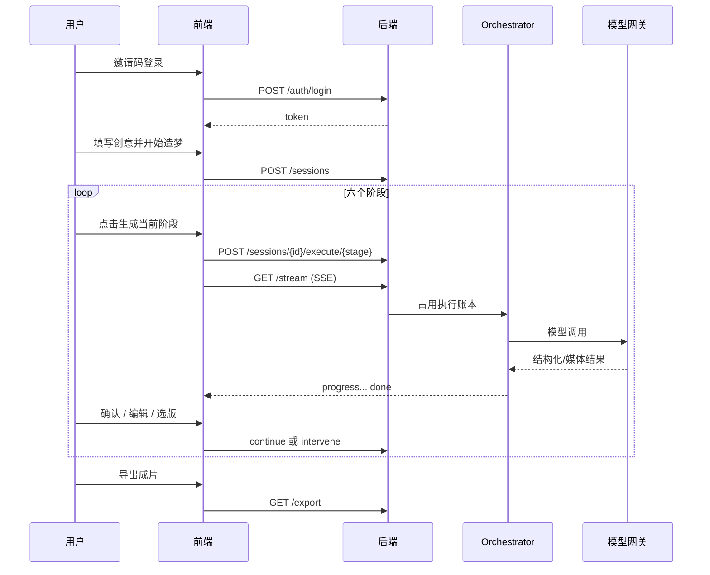

# AI造梦机 · 技术接入方案（汇报评审版）

> 文档版本：2026-10-04  
> 适用对象：产品 / 技术 / 合规评审  
> 权威需求：[PRD V1.3](../PRD/PRD.md)；本文已按2026-10-04双链路、知识库、模型选择及供应商恢复/费用控制同步。最终后端357/357、前端69/69及类型/Lint/构建通过，两条真实样片工程闭环通过；内容质量需迭代，原历史阶段证据保留。
> 实现状态：[项目状态](../项目状态.md)  
> 文档总目录：[文档目录](../文档目录.md)

> 2026-10-04批次说明：[上一轮整体自查](../evidence/整体链路自查/验收记录.md)完成267/60回归，并记录了当时尚无供应商续接与限额的缺口。本轮已接入供应商台账、冻结输入恢复、并发及费用预留；当前验收进度见[项目状态](../项目状态.md)。RAG独立质量与真实样片仍按各自证据判断，原自查不回写。

AI造梦机是一款面向个人创作者和小型内容团队的AI视频创作平台，帮助用户将创意或故事，通过可编辑、可确认的制作流程，转化为故事短视频或漫剧视频。

---

## 0. 一页结论

| 项 | 结论 |
| --- | --- |
| 产品 | AI视频创作平台，提供可编辑、可确认的故事短视频与漫剧视频两条独立制作链路 |
| 用户 | 个人创作者和小型内容团队 |
| 主场景 | ① 故事短视频 ② 漫剧视频 ③ 三种短视频快捷工具 ④ 共用知识库、作品库与素材复用 |
| 技术形态 | Next.js 前端 + FastAPI 后端 + SQLite 元数据 + 本地产物文件 + AIHubMix 模型网关 + FFmpeg |
| 部署现状 | **本地自用**（前端 3030 / 后端 8030）；上云方案已写好但暂缓 |
| 安全 | 邀请码登录、账号隔离、管理员专用设置/沙盒、普通用户可选公开模型、密钥不进前端、内容红线双向拦截 |
| 验证 | 当前357/69与类型/Lint/构建通过，运行3030/8030；故事/漫剧各2镜头完成并播放到ended无错误。跨进程视频续接和402后图像恢复已实测。内容质量需迭代，语音自然度与RAG08待验，独立检索未通过 |
| 执行保护 | 图像/视频供应商任务持久化、原输入校验续接、未知提交拒绝盲重提；默认并发平台2/账号1，月预算平台500/账号100元，可配置 |
| 明确不做 | 专业多轨剪辑、直播、会员广告变现；RAG 创作知识库已纳入 V1.2 |

---

## 1. 系统边界

### 1.1 系统内

```
┌─────────────────────────────────────────────────────────────┐
│  浏览器（夜幕影院 3D 工作台）                                  │
│  登录 / 创作台 / 双链路工作区 / 短视频工具 / 作品 / 知识库     │
│  用户模型选择；设置与沙盒仅管理员可见                        │
└───────────────────────────┬─────────────────────────────────┘
                            │ HTTP + SSE（同源 /api 代理）
┌───────────────────────────▼─────────────────────────────────┐
│  FastAPI 应用（本机 8030）                                    │
│  Auth · Sessions · Tasks · Assets · Knowledge · Models       │
│  Admin Settings/Sandbox · Health                             │
│  Orchestrator（故事/漫剧分别编排） · ShortPipelines（快捷三条）│
│  内容安全 · 执行账本 · 版本依赖                                │
└───────┬───────────────────┬───────────────────┬─────────────┘
        │                   │                   │
   SQLite 元数据        本地产物目录          模型客户端
   data/app.db          image/video/script    AIHubMix OpenAI 兼容
                                              + Edge TTS + FFmpeg
```

### 1.2 系统外（依赖 / 非本系统负责）

| 外部方 | 职责 | 本系统边界 |
| --- | --- | --- |
| AIHubMix | 文本 / 图像 / 视频模型推理 | 只传必要提示词、检索上下文与允许的参考图；不托管密钥到前端 |
| 模型厂商侧任务队列 | 长耗时图像/视频生成 | 后端持久化提交意图、任务标识、结果位置与状态；中断后由用户显式查询/下载，提交未知且无标识时拒绝盲重提 |
| 在线 Edge TTS / 操作系统 FFmpeg | 配音 / 合成 | TTS 需要联网；FFmpeg 本地执行，失败返回可读错误 |
| 火山引擎 veFaaS / TOS | 未来上云 | 方案见部署摘要；**当前未启用** |
| 第三方分析 / 广告 / 支付 | — | 本版不做 |

### 1.3 信任边界

1. **浏览器不可信**：所有权限在后端校验；前端隐藏按钮不算权限。  
2. **令牌可信窗口**：Bearer Token，TTL 由配置控制；登出即吊销。  
3. **文件路径不可由客户端指定任意本地路径**：上传与素材复用只接受安全文件名 / `asset_id`。  
4. **模型输出不可信**：结构化校验 + 内容安全结果侧拦截。

---

## 2. 用户、场景与结果验证

### 2.1 用户画像

| 角色 | 诉求 | 本系统回应 |
| --- | --- | --- |
| 个人创作者 | 不会剪辑也能出片 | 六阶段引导 + 自动成片 |
| 自媒体运营 | 快速出短内容 | 三条快捷短片一次提交 |
| 小团队 | 分账号隔离素材 | 邀请码账号隔离（本地多用户） |
| 产品经理 / 评审 | 看清边界与证据 | 本文 + 证据包 + 走查清单 |

### 2.2 核心场景

**场景 A · 故事成片**  
创作台填写创意、选择模型与可选知识库 → 创建故事项目 → 逐阶段生成并确认 → 编辑 / 选版 → 导出并确认完成。故事短视频默认 1 集，用户主动修改后按选择提交；不改写已有作品集数。

**场景 B · 快捷短片**  
首页切工具或短视频工具页 → 填输入 / 选素材 → 后台生成 → 作品库恢复进度 → 下载。

**场景 C · 断点续作**  
切页 / 刷新 / 服务重启后，从作品库或 URL 恢复；不自动重新付费生成。

**场景 D · 漫剧视频**

创作台切到漫剧 → 创建单集、默认 9:16 项目 → 剧本 → 角色场景 → 分镜对白 → 漫画镜头 → 角色配音 → 基础运镜与字幕 MP4 → 确认完成。三种快捷工具只服务短视频，知识库由两条链路共用、各项目独立绑定。

### 2.3 怎么验证「结果对不对」

| 层级 | 方法 | 通过标准 | 证据 |
| --- | --- | --- | --- |
| 联通 | 健康检查、登录、建会话 | HTTP 200、会话可查 | 本地联通检查 |
| 工程 | pytest / 前端测试 / typecheck / lint / build | 当前后端357/357、前端69/69及类型/Lint/构建通过；267/60为历史批次 | [本轮工程验证](../evidence/真实样片验收/工程验证.json)、[项目状态](../项目状态.md) |
| 产品闭环 | AC01～AC13、COMIC01～COMIC07 | 工程链路与本地测试素材合成已验证；AC07、COMIC07 真实效果待验 | [故事闭环](../evidence/V1.1创作闭环/)、[漫剧验收](../evidence/漫剧/验收记录.md) |
| 视觉质量 | D7 四维打分 | 平均 ≥ 2 且无 1 分项；2026-09-23 的 5 条历史样例通过，不代表新模型或漫剧效果通过 | `evidence/阶段2/样例打分/` |
| RAG | 独立留出检索集与真实生成引用 | 留出集 Recall=0.8，H01/H07/H08 未通过；RAG08 真实生成质量待验 | [RAG 验收](../evidence/RAG/验收记录.md) |
| 安全 | 双账号隔离、红线拦截 | 他人 404；违规拒绝 | 阶段 2/3 证据 |

---

## 3. 接口调用

### 3.1 约定

- 前缀：`/api`
- 鉴权：`Authorization: Bearer <token>`（除 `/health`、`/auth/login`）
- 错误：`{"error":{"code","message"}}`，不回堆栈
- SSE：必须以 `done` 或 `error` 收尾
- 幂等：故事/漫剧阶段执行与快捷任务支持 `Idempotency-Key`

### 3.2 接口一览

| 分组 | 方法 | 路径 | 说明 |
| --- | --- | --- | --- |
| 健康 | GET | `/api/health` | 存活 |
| 认证 | POST | `/api/auth/login` | 邀请码登录 |
| 认证 | POST | `/api/auth/logout` | 登出吊销 |
| 认证 | GET | `/api/auth/me` | 当前用户与 `is_admin` |
| 设置 | GET | `/api/settings` | 仅管理员；只读平台模型与开关（无密钥） |
| 沙盒 | GET | `/api/admin/sandbox` | 仅管理员；本人账号的会话/任务计数 |
| 模型 | GET | `/api/models` | 所有登录用户可读的可用模型目录，无网关/密钥/安全配置 |
| 额度 | GET | `/api/usage` | 当前账号本月限额、预留、按表计算、可用额度、并发与价格缺失摘要 |
| 额度 | GET | `/api/admin/usage` | 仅管理员的平台汇总；普通用户无权读取 |
| 项目 | POST | `/api/sessions` | 创建故事或漫剧；`project_type` 创建后不切换 |
| 项目 | PATCH | `/api/sessions/{id}/models` | 保存后续模型偏好，运行中 409 |
| 项目 | PATCH | `/api/sessions/{id}/knowledge` | 更新本人项目绑定的知识库 |
| 项目 | DELETE | `/api/sessions/{id}` | 逻辑删除本人非运行作品；成功 204，运行中 409，不存在/他人 404 |
| 漫剧 | GET | `/api/comic/voices` | 可用配音声线 |
| 故事 | GET | `/api/sessions` | 我的列表 |
| 故事 | GET | `/api/sessions/{id}` | 详情 |
| 故事 | POST | `/api/sessions/{id}/execute/{stage}` | 执行阶段 |
| 故事 | POST | `/api/sessions/{id}/continue` | 确认进入下一阶段 |
| 故事 | POST | `/api/sessions/{id}/intervene` | 保存 / 重生成 / 选版 |
| 故事 | GET | `/api/sessions/{id}/stream` | SSE 进度 |
| 恢复 | GET | `/api/sessions/{id}/recovery` | 本人项目最新执行的续接条件、任务安全摘要及不可恢复原因 |
| 恢复 | POST | `/api/sessions/{id}/resume` | `{execution_id: 原执行ID}`，固定原输入；返回原格式SSE |
| 故事 | GET | `/api/sessions/{id}/artifact/{stage}` | 阶段产物 |
| 故事 | GET | `/api/sessions/{id}/export` | 导出（可带 version_id） |
| 故事 | GET | `/api/sessions/{id}/media/{kind}/{filename}` | 鉴权媒体 |
| 快捷 | POST | `/api/tasks` | 创建短管线任务 |
| 快捷 | GET | `/api/tasks` | 列表 |
| 快捷 | GET | `/api/tasks/{id}` | 详情 |
| 快捷 | GET | `/api/tasks/{id}/stream` | SSE |
| 恢复 | GET | `/api/tasks/{id}/recovery` | 本人快捷任务的恢复状态 |
| 恢复 | POST | `/api/tasks/{id}/resume` | `{execution_id: 原执行ID}`，返回`{task_id}`；随后订阅既有stream |
| 快捷 | GET | `/api/tasks/{id}/export` | 导出 |
| 文件 | POST | `/api/upload` | 上传 |
| 素材 | GET | `/api/assets` | 本人生成图列表 |
| 素材 | GET | `/api/assets/{id}/media` | 读取 |
| 素材 | POST | `/api/assets/reuse` | 复用为上传输入 |

表中原标为「故事」的会话读取、执行、版本、媒体和导出接口也承载漫剧，由服务端 `project_type` 决定阶段与产物合同。知识库接口位于 `/api/knowledge`，包含库与文档版本管理、检索；完整合同见 [RAG 技术与数据设计](../RAG/RAG技术与数据设计.md)。

### 3.3 外部模型调用（概要）

| 能力 | 网关 | 首批公开模型 | 调用方 |
| --- | --- | --- | --- |
| 文本 / 剧本 / 分镜 | AIHubMix | `qwen3.5-plus` / `qwen3.5-flash` | LLM 客户端 |
| 文生图 / 角色场景 / 参考图 | AIHubMix | `qwen-image-2.0` / `qwen-image-2.0-pro` | Image 客户端 |
| 首帧视频 | AIHubMix | `wan2.7-i2v` / `wan2.6-i2v` / `doubao-seedance-2-5-260628` / `veo-3.1-generate-preview` | Video 客户端 |
| 首尾帧 / 参考图视频 | AIHubMix | Wan2.7对应模式模型，以及Seedance2.5/Veo3.1 | Video 客户端 |
| 漫剧 / 工具配音 | 在线 Edge TTS | 独立声线选择 | TTS 客户端 |

密钥仅存在于项目 `.env`，前端与设置接口不返回密钥。

2026-10-05接入增量不改变系统架构：新模型复用同一网关、客户端、异步执行和预算账本，只增加协议能力与参数分支。Seedance请求5秒，Veo请求8秒；Veo参考图合计最多3张，不支持1:1；规格不兼容在收费调用前拒绝。`GET /api/models`视频选项增加时长、比例、分辨率、图数和费用估算；片段记录请求时长。混合片段在FFmpeg拼接前统一帧率、画幅和音轨，不增加自动叙事剪辑能力。完整来源、字段和价格在[模型接入合同](用户模型选择技术适配.md)，真实生成对照仍待验；本文顶部2026-10-04数字保留为历史批次，最新工程结果见[项目状态](../项目状态.md)。

用户按工作流选择适用模型：漫剧仅文字/图片；文艺短视频文字仅用于短文扩写；角色动作工具用参考图视频；图片配音口播不展示未调用的生成模型。管理员公开名单与已适配能力取交集，目录不可用或无可用项时明确提示，不静默切换模型。详见 [用户模型选择技术适配](用户模型选择技术适配.md)。

---

## 4. 交互流程

### 4.1 故事成片（主流程）



阶段顺序：`script_generation` → `character_design` → `storyboard` → `reference_generation` → `video_generation` → `post_production`。

漫剧独立阶段顺序：`script_generation` → `character_design` → `comic_storyboard` → `comic_panels` → `comic_audio` → `comic_composition`。两条流程复用基础服务，不能在既有项目中互换；漫剧使用图片、配音和本地基础运镜合成，不调用故事的视频生成阶段。

关键人机边界：

- **系统自动做**：模型调用、落盘、状态机推进、失败保留产物  
- **用户决定**：是否进入下一阶段、是否重生成、是否导出  
- **禁止自动重交费**：刷新 / 重启不自动重新生成

### 4.2 快捷短片

一次 `POST /tasks` → 后台跑完 → SSE / 轮询恢复 → 导出。无分阶段人工停点。

### 4.3 版本与失效

编辑或更换上游后，下游标记 `stale`；默认导出拒绝失效依赖；历史成片可按 `version_id` 单独下载。

更改模型偏好只影响后续生成，不自动作废或改写旧产物。每次执行和产物版本记录实际 `model_usage`，选回历史素材恢复其原模型来源。作品删除写入 `session_deletions`，阻断旧链接、读取和旧快照恢复；保留媒体文件、共享素材及知识库，不做物理清理。

### 4.4 原执行恢复合同

普通生成/干预在获得执行记录后保存恢复快照。项目快照包括原阶段、请求、项目参数、模型选择与实际使用、上游版本和产物、相关文件哈希及知识库/文档版本；当前阶段已成功写入的部分产物不作为阻止自身继续的差异。快捷任务冻结类型、原输入、实际模型及文件内容。

`GET recovery` 返回 `execution_id`、`source_execution_id`、`can_resume`、`requires_reconciliation`、`reason/reason_code` 和安全的 `jobs` 摘要。无执行返回空列表与不可恢复状态；不向浏览器返回供应商任务ID、下载URL、本地路径或密钥。只有本人资源可读，已删除项目保持不可访问。

`POST resume` 必须携带来源执行ID。服务端验证归属、当前状态、原快照及之后有无输入/编辑变化，再原子认领恢复执行；同一来源的进行中或成功恢复复用记录，不因双击或网络重传再次生成。认领后再次验证冻结条件，在原供应商任务作用域中执行，已有任务按已保存标识查询/下载，未提交步骤可继续但仍需通过预算预留。输入变化返回`RESUME_INPUT_CHANGED`，旧任务无快照返回`RESUME_INPUT_MISSING`，前端显示原因。

图像/视频客户端在提交前保存意图，成功响应后保存供应商任务标识或结果URL，下载完成后保存产物信息。`unknown`或提交中但没有可核对标识时，恢复不可用且预留继续占用；不得把缺少响应解释成未收费。恢复下载与新的生成提交是不同动作，普通「重新生成」仍是一条新执行。

明确HTTP未受理（如402）或本地预算/停止门禁记录为`rejected`，与供应商已受理后失败、结果未知不同。`jobs`可附`retry_requires_submission`、`http_status`和`attempt`；顶层`can_resume=true`时用户可人工继续。系统复用成功任务，只为原被拒绝位置新建attempt并重新预算；`unknown`及408/409/5xx等结果不明状态继续要求核对，不盲目提交。

快捷文艺短视频的已完成短文扩写可复用，避免恢复时重复付费扩写。Edge TTS没有供应商任务续传合同：快捷流程可能重新合成配音；独立漫剧音频阶段若没有可恢复的图像/视频任务记录，不伪装成供应商续接，使用原阶段的明确重试入口。

### 4.5 并发、费用预留与统计合同

执行认领在同一SQLite写事务中先检查幂等/已存在执行，再检查平台及账号`pending/running`数量，默认平台2、账号1。超限返回429；普通生成和恢复统一受限，页面浏览、保存、确认不占用新的生成名额。

每次收费调用使用独立`call_id`和输入指纹。提交前以`BEGIN IMMEDIATE`检查归属、活动执行、价格及平台/账号月预算，再写入预留；默认平台500元、账号100元，按Asia/Shanghai自然月。相同调用标识与输入只复用原记录，冲突输入拒绝。价格来源为环境覆盖或项目内价格表，币种与来源信息必须有效，缺失返回`BUDGET_PRICE_UNCONFIGURED`，预算不足返回402。没有通过预留不得先调用供应商。

账本分开保存预留、按用量及当时价格快照计算的金额、供应商明确报告费用。已完成但未取得实际用量时，仍只能按原预留/估算口径记录，不能伪装成实付；供应商费用缺失保持`null`。明确失败按实际调用结果处理，未知提交保持占用；后续查询和下载复用已记录调用，原流程新增步骤另行预留。

`GET /api/usage`字段：`month/currency/limit_cny/reserved_cny/calculated_cny/provider_reported_cny/remaining_cny/uncertain_calls/estimated_completed_calls/concurrency/missing_price_models/notice`。`concurrency`包含`active/account_limit/global_limit`。普通账号只有本人汇总；`/api/admin/usage`为平台汇总。前端以“按表估算、已预留、可用额度”表达，供应商`null`为待核实。控制口径不是充值余额，也不能保证与供应商最终账单完全相同。

---

## 5. 数据流转

### 5.1 数据分类

| 类型 | 存哪 | 归属 | 生命周期 |
| --- | --- | --- | --- |
| 用户 / 邀请码 / Token | SQLite | 账号 | Token 可吊销 |
| 会话 / 任务元数据 | SQLite | `owner_id` | 会话支持逻辑删除；快捷任务不在此次删除范围内 |
| 知识库 / 文档版本 / 检索快照 | SQLite + 本地文档产物 | `owner_id` | 两条链路共用库，绑定和来源快照按项目保存 |
| 模型偏好 / 实际使用记录 | 会话、任务输入、产物版本 | `owner_id` | 下一次选择与历史使用记录分离 |
| 执行事件账本 | SQLite | 归属实体 | 支持重连与恢复 |
| 恢复快照 / 供应商任务及步骤 | SQLite | 执行、来源执行和`owner_id` | 冻结原输入、保留任务标识/结果位置；接口只返回安全摘要 |
| 模型费用账本 | SQLite | 账号、执行和`call_id` | 保存账期、用量/价格快照、预留、计算金额与可选供应商费用；未知结果保留占用 |
| 图片 / 视频 / 剧本文件 | `data/` 目录 | 经会话/任务校验 | 可导出；上传可删 |
| 前端草稿 | localStorage（按账号键） | 浏览器账号隔离 | 刷新保留；文件引用失效需重选 |
| 模型密钥 | `.env`（gitignore） | 运维 | 不上仓库 / 不上前端 |

### 5.2 流转示意

```
用户输入 → API 校验 →（可选上传落盘）→ Orchestrator/Pipeline
    → 模型网关（提示词+允许参考图）→ 结构校验 / 内容安全
    → 产物文件 + 元数据版本 / 依赖 → SSE 通知前端
    → 用户确认 → 下游阶段引用选定版本 → 导出成片
```

### 5.3 隐私与合规数据规则（已定 D5 / D10）

- 上传素材：只用于本次生成，可删除，界面告知用途  
- 禁止生成：真人肖像 / 公众人物、侵权 IP、违法内容  
- 日志：不记密钥、密码、完整用户长文稿  
- 当前本地自用；对外上线前须再过合规清单

---

## 6. 部署方式

### 6.1 当前（已采用）

| 项 | 值 |
| --- | --- |
| 前端 | Next.js dev / build，端口 **3030** |
| 后端 | uvicorn `127.0.0.1:8030`，单worker |
| 启动 | `./start.sh` 或分别启动 |
| 数据 | 项目内 `data/` |
| 备份 | 本地目录；上云前不依赖云备份 |

### 6.2 目标过渡档（已设计、暂缓执行）

见 [上线部署方案摘要](上线部署方案摘要.md)：

- 火山引擎 veFaaS + API 网关 HTTPS  
- 预留单实例 + SQLite 定期备份到对象存储  
- 企业认证暂缓；个人实名过渡  
- **创建任何付费云资源前必须再确认费用量级**

### 6.3 环境变量（名称级，不含值）

`AIHUBMIX_API_KEY`、`LLM_MODEL`、`IMAGE_T2I_MODEL`、`VIDEO_FIRST_FRAME_MODEL`、`VIDEO_START_END_MODEL`、`VIDEO_REFERENCE_MODEL`、`ADMIN_USER_IDS`、`PUBLIC_TEXT_MODELS`、`PUBLIC_IMAGE_MODELS`、三项 `PUBLIC_VIDEO_*_MODELS`、可选 `DATA_DIR`。具体名称与缺省值以项目 `.env.example` 为准；文档不记录真实密钥或账号令牌。

生成限额新增：`MAX_ACTIVE_EXECUTIONS`默认2、`MAX_ACTIVE_EXECUTIONS_PER_USER`默认1、`MONTHLY_BUDGET_CNY`默认500、`MONTHLY_USER_BUDGET_CNY`默认100。`MODEL_COST_RATES_JSON`未设置时读`backend/model-cost-rates.json`。收费文本请求另受已配置的输出token限制；价格表应覆盖实际公开模型、视觉检查模型和分辨率。参数说明及异常处理见[使用与运维说明](../使用与运维说明.md)。

### 6.4 运行与恢复边界

当前执行器仍在单后端进程中，SQLite和本地Qdrant/媒体目录没有因此变成分布式服务。事务约束保证本期执行认领和费用预留，不代表所有历史“检查后保存”操作都已完成跨进程验证。暂不增加worker或复制实例扩容。

进程重启后先核对本地执行与已完成结果，未完成任务明确中断，等待用户显式继续；不会因启动自动提交收费生成。供应商任务可能继续运行，因此本地中断不等于供应商取消。未知任务仍需要核对，当前没有自动供应商账单对账或自动云备份。备份应包含数据库、知识索引与媒体的一致状态，恢复演练与真实供应商长时间中断分别留证据。

### 6.5 本轮真实运行验证（2026-10-04）

后端最终357/357（`.runtime/tests-three-completions-final.log`）、前端69/69，类型/Lint/生产构建通过；3030/8030运行新版本，用户额度显示账号100元/月、平台500元/月、全局/账号并发2/1，实付null显示待核实。

故事与漫剧各1人1场景1集2镜头、均`session_completed`。故事H264/AAC、yuv420p、1280×720、10.099秒；漫剧H264/AAC、yuv420p、720×1280、3.755秒，含2句中文字幕与Edge TTS；浏览器均播放到`ended`且无error。视频首镜头任务ID持久化后主动kill隔离worker，再由新进程恢复，两镜头总视频POST为2次，无首镜头重复提交。真实图像HTTP402后充值继续复用第一张图，仅第二张创建新attempt。

30条模型费用账本为28 completed、1 rejected、1 uncertain；按表估算9.34644元、一次LLM超时预留0.114967元，实付null；Edge TTS不计入30笔。上述金额是本轮调用批次口径，不是供应商实付、单片成本或效率节省。

内容结论为**工程闭环通过；内容质量需迭代**。故事原5镜头、漫剧原4镜头由人工各缩为2；场景误用人物prompt问题修正为`SETTING_PROMPT`并仅重绘l1，`voice_map`臆造声线ID经结构修复再生成，prompt加入动态支持声线。灯塔尺度/人物合成感、漫画摄影背景与线稿风格、信封颜色跨镜头偏差仍保留，语音自然度未人工听审。证据：[验收记录](../evidence/真实样片验收/验收记录.md)、[工程验证](../evidence/真实样片验收/工程验证.json)、[样片预览](../evidence/真实样片验收/样片预览.html)。

---

## 7. 安全与合规

| 域 | 措施 | 状态 |
| --- | --- | --- |
| 身份 | 邀请码 → 用户 → Bearer Token | 已实现 |
| 授权 | 会话 / 任务 / 媒体 / 素材均校验 `owner_id` | 已实现 |
| 管理员 | `ADMIN_USER_IDS` 显式名单；设置/沙盒后端拒绝普通用户（403） | 已实现；注册不自动授予管理员 |
| 用户模型选择 | 普通用户可读公开目录；按白名单和生成模式校验，运行时禁止改偏好 | 已实现 |
| 密钥 | `.env` + gitignore；设置接口不回显 | 已实现 |
| 上传 | 类型 / 大小 / 安全文件名 | 已实现 |
| 内容安全 | 提示词侧 + 结果侧 | 已实现 |
| 错误泄露 | 统一错误结构，无堆栈 | 已实现 |
| 费用动作 | 用户明确生成或继续未提交/明确未受理步骤才调用；先检查价格、并发和预算，保留估算/实付区别 | 已通过357/69当前工程批次与运行页面检查；真实402恢复已验证 |
| 等保 / 对外合规 | 上线前专项 | **未做**（暂未上云） |
| 实名 / 内容审核牌照 | 对外前评估 | **未做** |

---

## 8. 逻辑自洽检查（评审用）

| 问题 | 答案 |
| --- | --- |
| 需求是否覆盖用户与场景？ | 是，PRD 第 1～2 节 + idea 调研文档 |
| 技术是否覆盖需求？ | 双链路、快捷工具、作品/知识/模型选择及恢复/限额均有代码；357/69与真实双样片工程闭环通过，内容质量继续迭代 |
| 是否存在「文档承诺但未做」？ | AC07/COMIC07真实样片仍有视觉偏差且语音自然度未听审，RAG08待验、独立检索未通过；完整动作迁移 / 嘴型 / 故事配音字幕仍属后续；上云暂缓 |
| 是否引入未触发模块？ | RAG 已有用户明确新增需求；会员商业化仍不做 |
| 验证是否可复核？ | 自动化命令 + 证据包路径齐全 |
| 费用如何控制？ | 默认平台/账号月预算500/100元、并发2/1；收费前原子预留，未知提交保留。按表控制额度不等于供应商最终账单 |

---

## 9. 相关文档索引

- 总目录：[../文档目录.md](../文档目录.md)  
- Agent 评测：[../Agent/](../Agent/)  
- 走查清单：[../MVP/06-产品走查清单.md](../MVP/06-产品走查清单.md) 等  
- 部署：[上线部署方案摘要.md](上线部署方案摘要.md)  
- 实现合同：[V1.1-创作闭环-技术适配与开发说明.md](V1.1-创作闭环-技术适配与开发说明.md)
- 双链路：[漫剧双链路技术适配与开发说明.md](漫剧双链路技术适配与开发说明.md)
- 模型选择：[用户模型选择技术适配.md](用户模型选择技术适配.md)
- 使用与运维：[使用与运维说明](../使用与运维说明.md)
- 项目介绍与指标口径：[主项目说明与项目经历](../项目介绍/主项目说明与项目经历.md)
