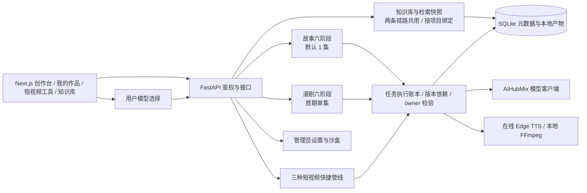
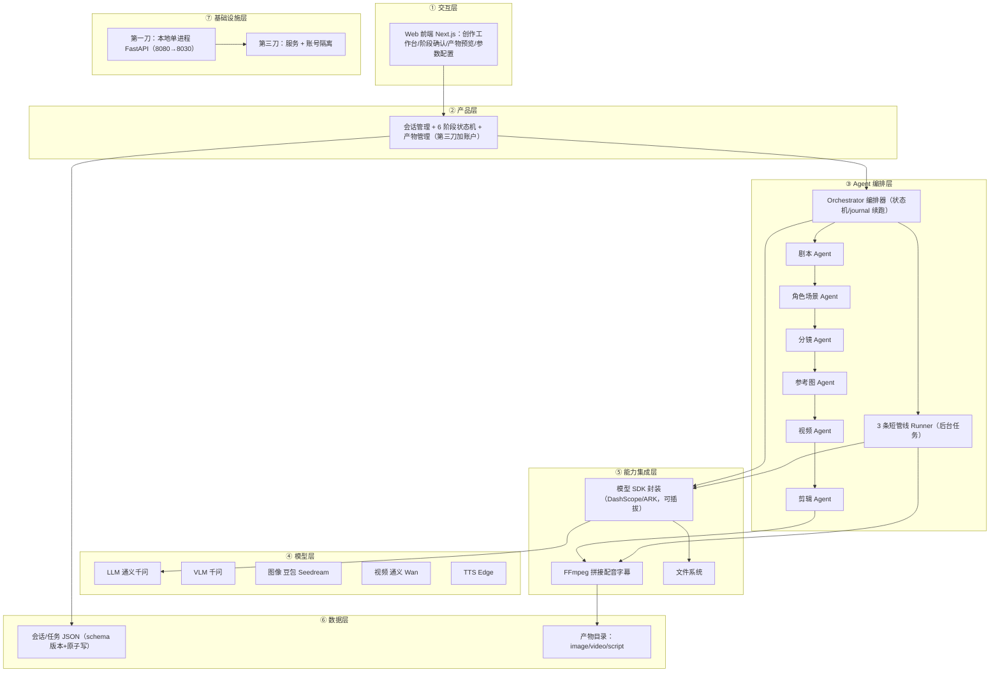

# AI造梦机 · 架构方案（蓝图推导，阶段 1）

> **文档性质：历史阶段 1 设计。** 下文「一」至「十」保留 2026-09-23 的推导过程，不代表当前已实现能力或待办；其中文件 JSON 元数据、暂缓账号/数据库、Seedream、统一配音字幕均不能作为现状依据。当前实现以 [PRD V1.3](../PRD/PRD.md)、[技术接入方案](技术接入方案-汇报评审版.md)与[项目状态](../项目状态.md)为准。

## 当前架构快照（2026-10-04）

AI造梦机是一款面向个人创作者和小型内容团队的AI视频创作平台，帮助用户将创意或故事，通过可编辑、可确认的制作流程，转化为故事短视频或漫剧视频。

- 故事：剧本 → 角色场景 → 分镜 → 参考图 → 视频 → 拼接成片。漫剧：剧本 → 角色场景 → 分镜对白 → 漫画镜头 → 角色配音 → 基础运镜与字幕 MP4；创建后不切换项目类型。
- 文艺短视频、角色动作短片、图片配音口播独立服务短视频。知识库、素材、作品库与任务/版本基础设施由两条主链路复用，各账号数据隔离。
- 元数据和执行账本已采用 SQLite；会话通过 `session_deletions` 逻辑删除，运行中拒绝删除，保留共享资料与媒体文件。
- 普通用户可通过公开目录选择适用的文字、图片、视频模型。选择按项目/任务持久化，实际使用记录随执行与版本保存；改偏好不自动改写或作废旧产物。设置与沙盒只向 `ADMIN_USER_IDS` 指定管理员开放，后端独立鉴权。
- 最新工程回归与页面验收见 [模型选择验收记录](../evidence/用户模型选择/验收记录.md)。真实本地 FFmpeg 合成验证采用测试素材；新版故事 AC07、漫剧 COMIC07、RAG08 真实生成质量待验，RAG 独立留出集未通过。历史真实样例不代替这些验收。
- 当前采用本地两个进程（3030/8030）。云端数据库、对象存储备份和生产部署尚未实施；临时外网转发不等同于上线。

## 历史设计正文

> 按蓝图 BLUEPRINT.md 五步 SOP 推导（Step 1~4）。当前 AI 按手册分析，未运行模型管线。
> 编排依据：项目要求分阶段生成、编辑与人工确认，由编排器管理阶段状态，各阶段处理明确的生成职责。

---

## 一、需求拆解（Step 1）

| 维度 | 结论 |
| --- | --- |
| 目标 | 从一句创意到一部完整成片（含剪辑/配乐/字幕） |
| 用户 | 短视频/短剧创作者；第一刀本地单机，第三刀对外多人 |
| 核心闭环 | 输入创意 → 6 阶段生成（每阶段可确认/修改）→ 完整成片 + 产物留存 |
| 交付物 | 成片视频 + 全链路中间产物（剧本、角色图、分镜、参考图、片段） |
| 边界 | 禁真人肖像/侵权 IP/违法内容；上传素材本地留存可删除 |
| 约束 | 视频生成 1~2 分钟/片段（异步）；月成本 500 元；国内模型 |

## 二、领域建模：Harness 五要素（Step 2）

| 槽位 | 落点 |
| --- | --- |
| 工具 | LLM/VLM 文本生成、文生图/图生图、图生视频（3 种方式）、TTS 配音、FFmpeg 拼接、文件读写、上传下载 |
| 知识 | 剧本/分镜/角色/场景/视觉风格提示词模板、模型能力清单（哪家支持哪个能力）、各平台 API 规范 |
| 观察 | 生成进度、任务状态、产物文件落盘、错误日志 |
| 行动 | 模型 API 调用、SSE 推送进度、产物文件写入 |
| 权限 | 密钥不进前端；内容红线双向拦截；删除需人工确认 |

## 三、组件选型（Step 3）

| 蓝图组件 | 选用 | 理由 |
| --- | --- | --- |
| 工作流运行时（s16） | ✅ | 编排形态固定（6 阶段状态机），脚本拥有编排、journal 断点续跑 |
| 工具系统（s02） | ✅ | 多个模型 API 需统一分派 |
| 后台任务（s11） | ✅ | 视频生成慢，丢后台 + 完成通知 |
| 子 Agent（s06） | ✅ | 6 个阶段各一专职 Agent，产物落盘后交回编排器 |
| 权限系统（s03） | ✅ | 内容红线 + 删除确认 |
| 上下文压缩（s08） | 部分 | 剧本/分镜数据大，裁历史工具结果、保留权威指令 |
| 记忆系统（s09） | ❌ 暂缓 | 跨会话风格偏好，后续增强 |
| MCP 插件（s14） | ❌ | 模型用官方 SDK 封装即可，不接外部工具生态 |
| 定时调度（s12） | ❌ | 无定时自治需求 |
| 目标闭环（s17） | ❌ | 固定流程，非自主判断何时完成 |
| Agent 团队（s13） | ❌ 暂缓 | 跨镜头一致性 Agent 归后续增强 |

## 四、七层架构（Step 4）

**贯穿数据流**：用户在 Web 输入创意 → 产品层建会话 → 编排器按 6 阶段依次调度专职 Agent → 每个 Agent 经能力集成层调模型 SDK → 模型层生成 → 产物写数据层（文件+JSON）→ 阶段产物经 SSE 推回前端确认 → 确认后进下一阶段 → 剪辑 Agent 用 FFmpeg 合成成片 → 产物可导出。

| 层 | 落地锚点 |
| --- | --- |
| ① 交互层 | Web（Next.js），同步确认 + 异步进度 |
| ② 产品层 | 会话、状态机、产物路由；第三刀加账户/登录 |
| ③ 编排层 | orchestrator.py（状态机 + 断点续跑）+ 6 个 *_agent.py + pipeline runner |
| ④ 模型层 | qwen（LLM/VLM）、seedream（图）、wan（视频）、edge-tts |
| ⑤ 能力集成层 | models/ 下各家客户端（可插拔）；FFmpeg；本地文件系统 |
| ⑥ 数据层 | 会话/任务 JSON + 产物目录（image/video/script） |
| ⑦ 基础设施层 | 第一刀本地单进程；第三刀服务化 |

## 五、工具清单

| 工具 | 输入 | 输出 | 副作用 | 权限要求 | 归属层 |
| --- | --- | --- | --- | --- | --- |
| 生成剧本 | 创意、风格、剧集数 | 结构化剧本（标题/梗概/角色/场景/剧集） | 无 | 需过内容红线 | ③→④ |
| 生成角色/场景图 | 角色/场景描述 | 多版本图片 | 写文件 | 内容红线 | ③→④ |
| 生成分镜 | 剧本 | 分镜表 | 无 | 内容红线 | ③→④ |
| 生成参考图 | 分镜提示词 | 首帧图 | 写文件 | 内容红线 | ③→④ |
| 生成视频片段 | 首帧/尾帧/参考图 + 提示词 | 视频片段 | 写文件、耗时长 | 内容红线 | ③→④ |
| TTS 配音 | 旁白文本 | 音频 | 写文件 | 无 | ④→⑤ |
| 剪辑合成 | 片段+音频 | 成片 | 写文件 | 无 | ⑤ |
| 上传素材 | 用户文件 | 本地路径 | 写文件 | 校验格式/大小/安全名 | ①→⑤ |
| 导出产物 | 产物路径 | 打包文件 | 读文件 | 无 | ⑤ |

## 六、系统提示词草案（各阶段 Agent）

> 以下为骨架，阶段 2 按提示词模板库细化。

- **剧本 Agent**：你是短视频编剧。根据用户创意，输出结构化剧本 JSON（title/logline/genre/mood/characters/settings/episodes）。角色要有名字、身份、性格；每集有标题和正文；正文要可拍摄（有画面、动作、对白）。不得出现真人肖像、侵权 IP、违法内容。
- **角色/场景 Agent**：根据剧本，为每个角色/场景产出视觉提示词并生成多版本图，保证同一角色跨镜头外观一致。
- **分镜 Agent**：把每集拆成镜头列表，每个镜头给出画面描述 + 生成提示词，衔接上一镜。
- **参考图 Agent**：为每个镜头生成首帧参考图，风格统一。
- **视频 Agent**：按用户选的生成方式（首帧/首尾帧/参考图）逐镜头生成视频片段。
- **剪辑 Agent**：按分镜顺序拼接片段，替换配音，加字幕，输出成片。

## 七、上下文与记忆策略

- **会话内**：剧本/角色/分镜为结构化 JSON 持久化，Agent 只带当前阶段所需上下文 + 上一阶段产物摘要，不重复塞全量历史。
- **跨会话**：风格/比例/模型偏好存会话 meta；跨会话"记住用户偏好"暂缓（记忆系统未选）。

## 八、权限与安全边界

- 密钥只在后端 `.env`，不进前端、不记日志。
- 内容红线：提示词侧过滤 + 生成结果侧审查，双向拦截。
- 删除项目/产物需人工确认；上传文件校验格式/真实类型/大小/安全文件名。
- 失败降级：模型调用超时/失败有限重试，SDK 初始化失败兜底；单个片段失败可重生成，不拖垮整条链路。

## 九、可观测性

- 日志：分级日志，不记密钥/密码/完整用户文档。
- 指标：每阶段耗时、每模型调用耗时/失败率、成本估算（对齐 500 元/月）。
- 轨迹：会话/任务 JSON 记录每步输入输出与模型名，为后续微调留原料。

## 十、技术栈与部署形态

- 后端：Python 3.12 + FastAPI + Pydantic，端口 **8030**
- 前端：Next.js + TypeScript + Tailwind，端口 **3030**（阶段 3）
- 存储：本地文件目录 + JSON 元数据（schema 版本）
- 部署：第一刀本地单进程；第三刀服务化 + 账号隔离
